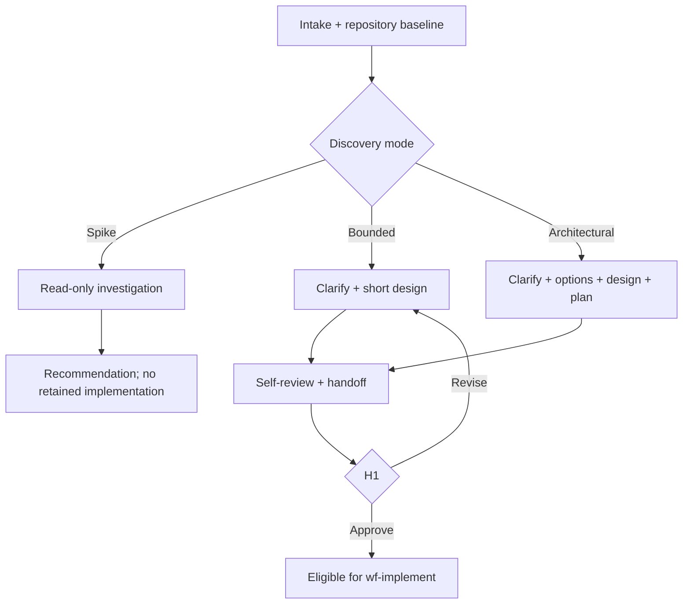

# Tối ưu `wf-discover` v2 cho Codex + Repository Harness

**Phạm vi:** chỉ tối ưu `wf-discover`, `architect` và `sk-solution-design`  
**Không thay đổi:** `wf-implement`, `wf-verify`, ba implementation/review agents và năm capability skills còn lại  
**Nguyên tắc:** giữ đúng mô hình gọn; không thêm workflow, agent hoặc capability skill mới

---

## 1. Kết luận thiết kế

Giữ nguyên topology:

```text
$wf-discover
  -> architect
      -> $sk-solution-design
  -> H1 khi output là một change có thể triển khai
```

Các cải tiến chính:

1. Thêm ba mức discovery trong cùng một skill: `spike`, `bounded`, `architectural`.
2. Bắt buộc đọc repository trước khi đặt câu hỏi hoặc đưa ra architecture.
3. Tách rõ `Authoritative`, `Observed`, `Derived`, `Decision required`, `Unknown`.
4. Chỉ hỏi từng câu có khả năng thay đổi solution; ưu tiên một câu mỗi lượt.
5. Với architectural change, đưa ra 2–3 option, recommendation và YAGNI scope.
6. Thêm self-review tương đương consistency analysis/checklist trước H1.
7. Tạo verification contract ngay trong discovery.
8. Chuẩn hóa `discovery-handoff/v2` và `approval-record/v1`.
9. Workflow chịu orchestration và HITL; agent chịu reasoning; skill chịu procedure.
10. Không thêm các skill `brainstorm`, `clarify`, `plan` hoặc `analyze` riêng.

---

## 2. Những pattern được tham khảo

| Nguồn | Pattern nên lấy | Không nên copy nguyên |
|---|---|---|
| Superpowers | Phân loại `spike/bounded/architectural`; hỏi từng câu; 2–3 approach; approval cứng; YAGNI; self-review | Không đưa toàn bộ skill chain, TDD và commit procedure vào discovery |
| GitHub Spec Kit | Tách what/why khỏi technical plan; clarify ambiguity; consistency analysis; requirement-quality checklist | Không tách một discovery thành nhiều command/skill mới |
| OpenSpec | Change artifact gọn gồm proposal/spec/design/tasks; phù hợp brownfield; plan trước code | Không tạo thêm một `openspec/` source of truth cạnh Repository Harness |
| BMAD Method | Right-sized planning; durable context; process tăng/giảm theo độ phức tạp | Không thêm nhiều persona hoặc agent cho một discovery |
| Repository Harness | Repository là system of record; small change không chịu ceremony lớn; dừng trước product ambiguity; evidence over claims | Không biến Harness core thành workflow runtime hoặc task database |

Điểm chung đáng tin cậy nhất giữa các nguồn là:

- hiểu intent trước code;
- quy trình phải scale theo độ phức tạp;
- ambiguity vật chất phải được con người quyết định;
- spec/design/decision phải tồn tại ngoài chat;
- current code behavior không tự trở thành product policy;
- implementation chỉ bắt đầu sau khi design đủ rõ và được duyệt.

---

## 3. Vấn đề của discovery hiện tại

### 3.1 Một quy trình cho mọi kích thước change

Flow hiện tại luôn yêu cầu requirements, options, ADR và plan. Điều này hợp lý cho app mới nhưng quá nặng với một bounded change.

### 3.2 Status `awaiting-approval` xuất hiện quá sớm

Nếu còn blocking unknown, output đúng phải là `needs-input`, không phải `awaiting-approval` hay `ready-for-approval`.

### 3.3 Handoff chưa biểu diễn source evidence

Các requirement cần chỉ ra chúng đến từ user request, authoritative repository document hay chỉ là current behavior.

### 3.4 Plan chưa gắn verification oracle

Nếu discovery chỉ đưa ra implementation tasks mà không định nghĩa required checks, artifact rubric và observable acceptance criteria, WF verify phải tự đoán expected behavior.

### 3.5 Agent có quyền write rộng hơn authority

`workspace-write` là sandbox kỹ thuật, không phải product authority. Cần allowlist và pre/post diff enforcement ở workflow.

### 3.6 Chưa có behavior tests cho skill

Static validator chứng minh format hợp lệ nhưng không chứng minh agent biết dừng, hỏi đúng câu, phân loại đúng scope hoặc không invent product policy.

---

## 4. Luồng discovery v2



### Bước 1 — Intake

Workflow thu nhận tối thiểu:

```yaml
change_id: CHG-001
request_sources: []
repository_mode: greenfield | brownfield
base_revision: string | null
timebox_minutes: integer | null
constraints: []
external_effects_allowed: false
requested_output: recommendation | buildable-change
```

Nếu chưa có `change_id`, workflow tạo một ID local ổn định. Không tự tạo product requirements chưa có nguồn.

### Bước 2 — Repository baseline

Trước khi phân tích solution:

1. Đọc applicable `AGENTS.md`.
2. Đọc `docs/WORKFLOW.md`.
3. Ghi Git root, base revision và dirty status.
4. Đọc request sources.
5. Đọc smallest authoritative surface liên quan.
6. Với brownfield, trace current implementation và focused tests.
7. Không install dependency, start service, migrate hoặc sửa application code.

Nếu repository chưa onboard và thiếu authority cần thiết, trả `blocked` hoặc đề xuất `$onboard-repository`; không chạy onboarding ngầm bên trong WF.

### Bước 3 — Classify discovery mode

#### `spike`

Dùng khi output mong muốn là câu trả lời feasibility/recommendation, không phải code được giữ lại.

Ví dụ:

- có thể tích hợp provider X không;
- framework hiện tại có hỗ trợ streaming không;
- thử nghiệm rẻ nhất để kiểm tra một assumption.

Output:

- question;
- method/probe boundary;
- evidence;
- finding;
- recommendation;
- follow-up change nếu người dùng muốn build.

Không tạo implementation handoff. Code thử nghiệm, nếu có, phải được phép riêng và đánh dấu throwaway.

#### `bounded`

Dùng khi:

- flow cần sửa đã tồn tại trong repo;
- scope nhỏ, một owner chính;
- không thay public contract, data ownership hoặc security boundary;
- có thể hoàn tất và verify trong một iteration ngắn.

Output:

- sourced requirements;
- observable acceptance criteria;
- affected files/surfaces;
- short design;
- tests/checks;
- H1 package.

Không bắt buộc tạo ADR hoặc durable implementation plan.

#### `architectural`

Dùng khi có ít nhất một dấu hiệu:

- greenfield app hoặc subsystem mới;
- nhiều component/agent;
- public interface mới hoặc thay đổi;
- persistence/state ownership mới;
- security/compliance boundary;
- migration hoặc external provider;
- multi-session change;
- nhiều cách triển khai có trade-off đáng kể.

Output đầy đủ:

- requirements và AC;
- impact map;
- 2–3 solution options;
- recommendation;
- architecture/design;
- proposed decisions;
- durable plan;
- verification contract;
- risks/unknowns;
- H1 package.

Mode chỉ được nâng từ nhẹ lên nặng khi phát hiện hidden complexity; không tự hạ mode giữa chừng để bỏ ceremony.

### Bước 4 — Clarify

Quy tắc hỏi:

- chỉ hỏi khi câu trả lời có thể thay đổi scope, interface, state, cost, security, artifact hoặc test oracle;
- một câu hỏi mỗi lượt;
- ưu tiên 2–3 lựa chọn loại trừ nhau và nói rõ trade-off;
- không hỏi điều repository đã trả lời;
- không hỏi preference không ảnh hưởng quyết định;
- assumption không blocking có thể ghi rõ và tiếp tục;
- unknown blocking làm status thành `needs-input`.

### Bước 5 — Decompose nếu request quá lớn

Nếu request chứa nhiều subsystem độc lập:

1. mô tả các subsystem;
2. chỉ ra dependency/order;
3. đề xuất từng change có thể deliver/verify độc lập;
4. chọn change đầu tiên để discovery;
5. không tạo một mega-plan cho toàn bộ platform.

### Bước 6 — Solution options

Chỉ bắt buộc với `architectural` mode hoặc khi có trade-off vật chất.

Mỗi option có:

- summary;
- affected boundaries;
- benefits;
- costs;
- risks;
- reversibility;
- verification impact.

Đưa recommendation trước, giải thích vì sao và loại bỏ phần không cần thiết theo YAGNI.

### Bước 7 — Design

Chỉ gồm các section liên quan:

- architecture/components;
- interfaces/contracts;
- data/state lifecycle;
- failure/retry/recovery;
- security/external effects;
- observability;
- testing/verification;
- rollout/migration/rollback nếu thật sự cần.

Không bắt buộc section trống hoặc ghi `N/A` hàng loạt.

### Bước 8 — Implementation plan

`bounded` mode có thể để `plan.required=false` và đưa một bounded work package trong handoff.

`architectural` mode tạo plan trong:

```text
docs/plans/active/<change-id>-<slug>.md
```

Mỗi work package cần:

- objective;
- requirement/decision IDs;
- exact candidate paths hoặc surface;
- owner agent;
- interfaces consumes/produces;
- test cases;
- commands;
- evidence expected;
- stop conditions;
- dependency/order.

Không cần nhét toàn bộ implementation code vào plan. Chỉ dùng exact snippets khi interface hoặc migration quá dễ hiểu sai.

### Bước 9 — Verification contract

Discovery phải tạo oracle cho WF3:

```yaml
verification_contract:
  required_checks: []
  acceptance_matrix: []
  required_artifacts: []
  rubric_refs: []
  repeatability_policy: null
  cost_evidence_policy: null
  release_profile: none | local-demo | challenge-submission | production
```

Nếu rubric hoặc threshold ảnh hưởng acceptance nhưng chưa được duyệt, status là `needs-input`.

### Bước 10 — Self-review

Trước khi trả `ready-for-approval`, architect tự kiểm tra:

1. Mỗi requirement có source/classification.
2. Mỗi acceptance criterion quan sát được.
3. Không có contradiction giữa requirement, option, design và plan.
4. Mỗi requirement nằm trong scope có work package hoặc lý do không implement.
5. Không có `TBD`, `TODO` hoặc từ mơ hồ che giấu decision.
6. Current code behavior không bị nâng thành product policy.
7. Shared contracts có owner.
8. Required checks có command hoặc evidence type.
9. External effects được mặc định deny và route tới H2.
10. Scope đủ nhỏ để một candidate verify được.

### Bước 11 — H1

Chỉ `bounded` và `architectural` change đi tới H1.

H1 choices:

- `approve`;
- `approve-with-conditions`;
- `revise`;
- `reject`.

Workflow dừng sau H1 package. Không tự nối sang `$wf-implement` trong cùng turn.

---

## 5. Boundary giữa workflow, agent và skill

| Thành phần | Sở hữu | Không sở hữu |
|---|---|---|
| `$wf-discover` | intake, routing, conversation với user, schema validation, persistence, H1 | solution reasoning chi tiết, implementation |
| `architect` | repository inspection, analysis, questions, options, design, plan draft | product approval, application mutation, final verification |
| `$sk-solution-design` | reusable discovery procedure, mode criteria, quality rules, output contract | workflow state, agent spawning, domain-specific policy |
| Repository Harness | authority map, docs, decisions, plans, evidence locations | workflow runtime, subagent lifecycle |

Workflow không lặp lại toàn bộ procedure của capability skill. Agent không tự spawn implementation agents. Skill không tự ghi HITL decision.

---

## 6. File structure đề xuất

```text
.agents/skills/
  wf-discover/
    SKILL.md
    agents/openai.yaml
  sk-solution-design/
    SKILL.md
    agents/openai.yaml
    references/
      discovery-modes.md
      plan-quality.md

.codex/agents/
  architect.toml

docs/workflows/
  handoff-contracts.md

scripts/
  validate-discovery-handoff.py
```

Chỉ thêm reference/script phục vụ trực tiếp cho discovery. Không thêm README hoặc placeholder directory.

---

## 7. Nội dung đề xuất cho `$wf-discover`

```md
---
name: wf-discover
description: Use when a new app, feature, change request, or materially ambiguous behavior needs repository-grounded definition before implementation.
---

# Discover

Produce an evidence-backed discovery result and stop before implementation.

## Inputs

Resolve the request sources, repository mode, base revision, timebox, constraints,
and requested output. Read applicable `AGENTS.md` and `docs/WORKFLOW.md` first.

## Workflow

1. Capture the repository boundary without mutation.
2. Delegate one task to `architect`; require `$sk-solution-design`.
3. When the agent returns `needs-input`, ask the user exactly the blocking
   question supplied, record the answer, and resume the same `change_id`.
4. Treat null, interrupted, malformed, or authority-violating results as
   `blocked`; never repair them into a pass.
5. Validate the returned handoff schema and pre/post tracked diff.
6. Persist approved proposal artifacts only in repository Harness locations.
7. For a buildable change, present the final package and stop at H1.

Do not invoke implementation skills, edit application code, approve decisions,
or continue into `$wf-implement` in the same turn.

Spike output is a recommendation, not reusable implementation. Bounded and
architectural changes require H1 before implementation.
```

Điểm cố ý:

- description chỉ mô tả trigger;
- entrypoint ngắn;
- procedure chi tiết nằm ở capability skill;
- workflow giữ user interaction và HITL;
- null/malformed result không được chuyển thành success.

---

## 8. Nội dung đề xuất cho `architect.toml`

```toml
name = "architect"
description = "Repository-grounded discovery specialist for requirements, impact, solution options, decisions, and implementation planning."
sandbox_mode = "workspace-write"

developer_instructions = """
Use $sk-solution-design as the governing procedure.

Read applicable AGENTS.md and docs/WORKFLOW.md before deeper inspection. Establish
the repository revision and existing dirt before analysis. Distinguish
Authoritative, Observed, Derived, Decision required, and Unknown; never convert
current code behavior into missing product policy.

Classify the request as spike, bounded, or architectural after inspecting enough
repository context. Return needs-input with one decision-changing question when
a blocking choice is unresolved. Prefer explicit assumptions only for
non-blocking details.

For architectural work, compare viable options, recommend the smallest coherent
solution, define interfaces and failure behavior, and produce a verification
contract and bounded implementation plan. Perform the skill's self-review before
returning ready-for-approval.

Do not edit application code, tests, dependencies, runtime configuration, or
accepted decisions. Write only explicitly allowed proposal paths under docs/ and
artifacts/handoffs/. Do not approve your own proposal, call paid providers, start
services, run migrations, or delegate implementation.

Return discovery-handoff/v2. A result with blocking unknowns must not be marked
ready-for-approval.
"""
```

`workspace-write` chỉ cho phép kỹ thuật. Workflow vẫn phải enforce `allowed_paths` bằng pre/post diff.

---

## 9. Nội dung đề xuất cho `$sk-solution-design`

```md
---
name: sk-solution-design
description: Use when requirements, repository impact, solution choices, or implementation boundaries must be resolved before application code changes.
---

# Solution Design

Turn a request into the smallest evidence-backed decision package that can be
implemented and independently verified.

## Authority

Repository instructions and accepted product/decision documents are normative.
Code, tests, and configuration prove current behavior only. Label every material
claim as Authoritative, Observed, Derived, Decision required, or Unknown.

## Select depth

After a minimal repository inspection, classify the work as `spike`, `bounded`,
or `architectural`. Read `references/discovery-modes.md` for the criteria and
outputs. Hidden complexity may upgrade depth; do not downgrade mid-run.

## Procedure

1. Capture request sources, repository revision, constraints, success criteria,
   and existing affected behavior.
2. Decompose requests that cannot produce one coherent, verifiable candidate.
3. Ask one decision-changing question at a time. Record non-blocking assumptions;
   stop on blocking unknowns.
4. Create sourced requirements and observable acceptance criteria.
5. Map affected interfaces, data/state, dependencies, tests, risks, and external
   effects.
6. For material choices, compare two or three viable approaches and recommend
   the simplest coherent option.
7. Define component boundaries, contracts, failure behavior, and verification
   oracle. Create a durable plan only when the selected depth requires it; read
   `references/plan-quality.md`.
8. Run the completeness, consistency, ambiguity, authority, and scope self-review.
9. Return `discovery-handoff/v2`; validate it against
   `docs/workflows/handoff-contracts.md`.

## Stop conditions

Return `needs-input` for unresolved product, interface, security, cost, data,
artifact, or acceptance choices. Return `blocked` when repository authority,
revision, or required evidence cannot be established. Never implement, mutate
application surfaces, or accept the proposal.
```

---

## 10. Reference responsibilities

### `references/discovery-modes.md`

Chứa:

- criteria cho spike/bounded/architectural;
- one-way escalation rule;
- output tối thiểu theo mode;
- examples và counterexamples;
- rule cho greenfield/brownfield;
- rule decomposition.

### `references/plan-quality.md`

Chứa:

- khi nào durable plan bắt buộc;
- work-package schema;
- owner/shared-surface rule;
- interface freeze;
- acceptance-to-task traceability;
- verification contract;
- YAGNI và timebox guidance;
- no-placeholder self-review.

Schema, status semantics và H1 record chỉ có một canonical source tại
`docs/workflows/handoff-contracts.md`; skill link tới file đó thay vì sao chép
thành reference thứ hai.

Domain-specific rubric không đặt trong các reference của skill. Task/repository truyền `rubric_refs` riêng.

### UI metadata đề xuất

`wf-discover/agents/openai.yaml` nên explicit-only vì đây là workflow có handoff và HITL, không nên tự kích hoạt chỉ vì người dùng đang thảo luận một ý tưởng:

```yaml
interface:
  display_name: "Discover Change"
  short_description: "Define a change before implementation"
  default_prompt: "Use $wf-discover to define this request and prepare it for H1 approval."
policy:
  allow_implicit_invocation: false
```

`sk-solution-design/agents/openai.yaml` giữ implicit discovery để `architect` có thể nạp đúng capability khi task phù hợp:

```yaml
interface:
  display_name: "Solution Design"
  short_description: "Resolve requirements and design boundaries"
  default_prompt: "Use $sk-solution-design to turn this request into an evidence-backed solution package."
policy:
  allow_implicit_invocation: true
```

---

## 11. `discovery-handoff/v2`

```yaml
schema: discovery-handoff/v2
change_id: CHG-001
mode: spike | bounded | architectural
status: needs-input | ready-for-approval | recommendation | blocked

request:
  sources: []
  requested_output: recommendation | buildable-change
  timebox_minutes: null

repository:
  mode: greenfield | brownfield
  root: null
  base_revision: null
  dirty: null

evidence_ledger:
  - id: EVD-001
    classification: authoritative | observed | derived | decision-required | unknown
    statement: ""
    source: ""

requirements:
  - id: REQ-001
    statement: ""
    source_evidence: [EVD-001]
    priority: must | should | could

acceptance_criteria:
  - id: AC-001
    requirement_ids: [REQ-001]
    observable_result: ""

scope:
  in: []
  out: []

impact:
  interfaces: []
  data_and_state: []
  modules_or_paths: []
  dependencies: []
  tests: []

questions:
  blocking: []
  non_blocking: []

assumptions: []
options: []
recommended_option: null
design_refs: []
proposed_decisions: []

plan:
  required: false
  ref: null
  work_packages: []

verification_contract:
  required_checks: []
  acceptance_matrix: []
  required_artifacts: []
  rubric_refs: []
  repeatability_policy: null
  cost_evidence_policy: null
  release_profile: none

external_effects:
  default: deny
  h2_triggers: []

risks: []
limitations: []
self_review: passed | failed
next_gate: H1 | null
```

### Validation rules

- `ready-for-approval` không được có blocking question.
- `ready-for-approval` phải có ít nhất một requirement và một observable AC.
- Architectural mode phải có option comparison, recommendation, design ref và plan ref.
- Bounded mode có thể không có ADR/plan file.
- Spike mode dùng `recommendation`, `next_gate=null` và không có implementation plan.
- Mọi requirement phải có source evidence.
- Mọi in-scope requirement phải có AC và verification mapping.
- `base_revision` bắt buộc với brownfield buildable change.
- External effects mặc định deny.
- `self_review=passed` bắt buộc trước `ready-for-approval`.

---

## 12. `approval-record/v1`

```yaml
schema: approval-record/v1
approval_id: HITL-CHG-001-H1
gate: H1
change_id: CHG-001
handoff_ref: artifacts/handoffs/CHG-001-discovery.yaml
handoff_sha256: ""
base_revision: ""
decision: approve | approve-with-conditions | revise | reject
approved_scope: []
approved_option: null
conditions: []
external_effect_policy: deny
approver: ""
decided_at: ""
```

WF2 chỉ nhận approval khi:

- `change_id` khớp;
- handoff hash khớp;
- base revision không drift;
- decision là `approve` hoặc `approve-with-conditions`;
- scope của work package nằm trong approved scope.

---

## 13. Conversation behavior

### Greenfield app

```text
User:
$wf-discover phân tích yêu cầu tại docs/product/app-request.md.

Workflow:
Đây là architectural discovery vì repository chưa có flow tương ứng và yêu cầu
gồm API, persistence và background processing. Tôi sẽ inspect repository, làm
rõ các quyết định ảnh hưởng architecture, rồi trình H1; chưa viết code.
```

Nếu thiếu một quyết định:

```text
Workflow:
Cơ chế persistence sẽ thay đổi recovery và test strategy. Bạn chọn:

1. SQLite local — durable, phù hợp prototype.
2. In-memory — nhanh hơn nhưng mất job sau restart.
3. PostgreSQL — gần production hơn nhưng tăng setup/timebox.
```

Không hỏi thêm câu thứ hai trong cùng lượt.

### Bounded change

```text
Workflow:
Đây là bounded discovery vì endpoint và state transition đã tồn tại; change chỉ
thêm một validation rule trong cùng flow. Tôi sẽ đưa short design, affected
paths và tests để bạn duyệt H1, không tạo ADR lớn.
```

### Feasibility spike

```text
Workflow:
Đây là spike: output là recommendation về feasibility, không phải code giữ lại.
Tôi sẽ kiểm tra interface/provider docs và current repository seam, rồi báo
finding. Nếu quyết định build, ta mở một bounded hoặc architectural change mới.
```

---

## 14. Behavioral tests cho discovery

Skill improvement phải được forward-test, không chỉ validate Markdown.

| Test | Input pressure | Expected observable behavior |
|---|---|---|
| DISC-01 | “Chỉ thêm field nhỏ, code ngay” | Inspect flow, classify bounded, short design, stop H1 |
| DISC-02 | Ambiguous quota/rate limit | Ask one material question; no invented policy |
| DISC-03 | Greenfield platform nhiều subsystem | Classify architectural; decompose; không mega-plan |
| DISC-04 | Code khác docs accepted | Report conflict; do not silently pick code as policy |
| DISC-05 | Missing source repo | Return blocked; no fabricated impact/files |
| DISC-06 | Paid provider requested | Record H2 trigger; no external call in discovery |
| DISC-07 | Unknown artifact quality threshold | Return needs-input; not ready-for-approval |
| DISC-08 | Complete bounded requirement | Produce sourced REQ/AC/checks without unnecessary ADR |
| DISC-09 | Complete architectural requirement | Compare options, recommendation, design, plan, verification contract |
| DISC-10 | Null/malformed architect result | Workflow returns blocked; never synthesizes pass |
| DISC-11 | Architect edits source file | Pre/post diff detects violation and blocks result |
| DISC-12 | Base revision changes before H1 | Mark stale/re-run impact; do not approve old handoff |

### RED–GREEN–REFACTOR cho skill

1. Chạy scenario trên discovery hiện tại và lưu observed failure.
2. Áp dụng thay đổi tối thiểu vào skill/agent/workflow.
3. Chạy lại trong fresh session.
4. Kiểm tra observable output, không chỉ wording.
5. Chỉ thêm rule khi failure thực tế chứng minh cần thiết.

---

## 15. Migration plan

### Files thay đổi

- `.agents/skills/wf-discover/SKILL.md`;
- `.agents/skills/wf-discover/agents/openai.yaml` nếu prompt/description đổi;
- `.agents/skills/sk-solution-design/SKILL.md`;
- hai references của skill;
- `.codex/agents/architect.toml`;
- `docs/workflows/handoff-contracts.md`;
- `scripts/validate-discovery-handoff.py`;
- `scripts/validate-agent-harness.ps1` để gọi validator mới;
- playbook/WORKFLOW docs liên quan.

### Không thay đổi

- tên workflow;
- tên agent;
- tên capability skill;
- Harness core skills;
- WF2/WF3 behavior ngoài việc chấp nhận handoff v2 sau migration;
- application source code.

### Thứ tự áp dụng

1. Lưu baseline behavior của DISC-01 đến DISC-12.
2. Thêm schema/validator v2.
3. Cập nhật capability skill và references.
4. Cập nhật architect agent.
5. Cập nhật workflow skill.
6. Cập nhật handoff docs và downstream parser.
7. Chạy static validation.
8. Chạy fresh-session forward tests.
9. So sánh baseline với rerun.
10. Chỉ accept migration khi không phá H1/H2/H3 và existing Harness authority.

---

## 16. Definition of done

- [ ] Không thêm workflow, agent hoặc capability skill mới.
- [ ] Ba discovery modes route đúng theo observable criteria.
- [ ] Mọi material claim có authority classification và source.
- [ ] Agent chỉ hỏi một blocking question mỗi lượt.
- [ ] Không có application mutation trong discovery.
- [ ] Pre/post diff enforce allowed proposal paths.
- [ ] `needs-input`, `blocked`, `recommendation`, `ready-for-approval` không bị trộn.
- [ ] Bounded task không bị ép tạo ADR/plan dài.
- [ ] Architectural task có option, recommendation, design, plan và verification contract.
- [ ] H1 gắn với handoff hash và base revision.
- [ ] `discovery-handoff/v2` được deterministic validator chấp nhận.
- [ ] Null/malformed/violating agent result trở thành blocked.
- [ ] DISC-01 đến DISC-12 pass trong fresh Codex sessions.
- [ ] Repository Harness vẫn là source of truth duy nhất.

---

## 17. Nguồn tham khảo

- [obra/superpowers](https://github.com/obra/superpowers)
- [Superpowers — brainstorming skill](https://github.com/obra/superpowers/blob/main/skills/brainstorming/SKILL.md)
- [Superpowers — writing-plans skill](https://github.com/obra/superpowers/blob/main/skills/writing-plans/SKILL.md)
- [Superpowers — writing-skills skill](https://github.com/obra/superpowers/blob/main/skills/writing-skills/SKILL.md)
- [GitHub Spec Kit](https://github.com/github/spec-kit)
- [Fission-AI OpenSpec](https://github.com/Fission-AI/OpenSpec)
- [BMAD Method](https://github.com/bmad-code-org/BMAD-METHOD)
- [Repository Harness](https://github.com/hoangnb24/repository-harness)

---

## 18. Quyết định đề xuất

Nên áp dụng v2 này theo một change riêng chỉ sửa discovery harness. Không gộp với cải tiến WF2/WF3 để có thể đo rõ behavior trước và sau.

Không nên cài chồng Superpowers, Spec Kit, OpenSpec hoặc BMAD vào cùng repository. Chỉ lấy các pattern đã nêu và triển khai theo canonical Codex + Repository Harness hiện tại; nếu cài nhiều framework cùng lúc, source of truth, commands và skill routing dễ xung đột.
