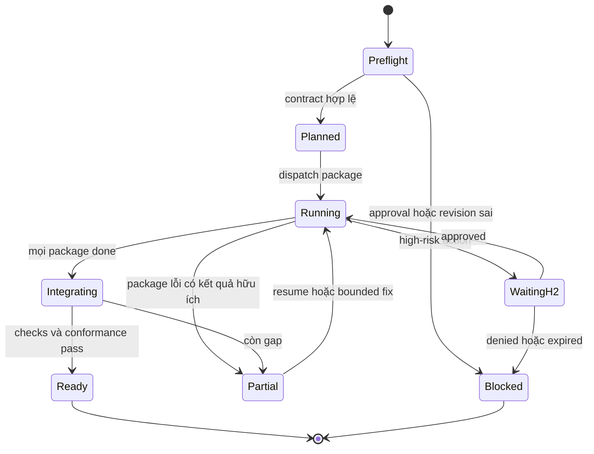

# WF Implement v2 — thiết kế tối ưu cho Repository Harness

**Ngày nghiên cứu:** 2026-09-13  
**Phạm vi:** chỉ nâng cấp workflow implementation hiện có  
**Inventory giữ nguyên:** `wf-implement`, `backend-dev`, `ai-dev`,
`sk-backend-engineering`, `sk-ai-engineering`, `sk-test-engineering`  
**Harness nền:** [hoangnb24/repository-harness](https://github.com/hoangnb24/repository-harness)

## 1. Kết luận

Không cần tạo thêm workflow, agent hoặc skill.

Nâng `wf-implement` thành một orchestrator có contract rõ, có khả năng resume và
chỉ giao một work package hữu hạn cho mỗi agent invocation. Hai implementation
agent vẫn giữ specialization hiện tại; ba capability skill được làm rõ hơn về
contract-first engineering, test mode và evidence.

Thiết kế đích:

```text
wf-implement
├── backend-dev
│   ├── sk-backend-engineering
│   └── sk-test-engineering
└── ai-dev
    ├── sk-ai-engineering
    └── sk-test-engineering
```

Nâng cấp chính:

1. Preflight xác minh H1, revision, scope và repository state trước khi sửa file.
2. Chuyển approved plan thành dependency-aware work packages.
3. Mỗi invocation nhận một task brief nhỏ, không nhận toàn bộ lịch sử chat.
4. Áp dụng RED → GREEN → REFACTOR khi có observable behavior cần thay đổi.
5. Chỉ parallel khi file, state và dependency thật sự độc lập.
6. Có durable progress ledger để resume mà không chạy lại task đã hoàn tất.
7. Không tin tuyên bố `done` của agent nếu thiếu diff và command evidence.
8. Dừng tại H2 trước external/high-risk effect.
9. Chạy conformance scan nội bộ trước khi bàn giao candidate cố định sang WF3.

## 2. Nguồn tham khảo và phần nên lấy

GitHub stars thay đổi theo thời gian; stars chỉ dùng để ưu tiên repo có mức độ
quan tâm cao, không dùng làm bằng chứng rằng toàn bộ thiết kế của repo đó phù hợp.

| Nguồn | Ý tưởng tốt cho WF2 | Cách áp dụng có chọn lọc |
|---|---|---|
| [obra/superpowers](https://github.com/obra/superpowers) | Fresh agent context theo task; RED/GREEN/REFACTOR; isolated worktree; evidence trước completion; stop khi plan có vấn đề | Một invocation cho một work package; task brief hữu hạn; evidence gate; worktree theo risk profile |
| [Superpowers: subagent-driven development](https://github.com/obra/superpowers/blob/main/skills/subagent-driven-development/SKILL.md) | Task status rõ; ledger; review theo task; không truyền toàn bộ session history | Giữ status và ledger; thay “review agent sau từng task” bằng self-review + coordinator contract check để không trùng WF3 |
| [Superpowers: executing plans](https://github.com/obra/superpowers/blob/main/skills/executing-plans/SKILL.md) | Review plan trước khi chạy; theo dõi task; dừng khi blocker/plan gap | Đưa vào preflight và failure routing |
| [Superpowers: test-driven development](https://github.com/obra/superpowers/blob/main/skills/test-driven-development/SKILL.md) | Phải quan sát test fail đúng lý do trước khi viết minimal implementation | Dùng cho observable behavior; cho phép mode khác với lý do rõ cho characterization, generated code, docs hoặc config |
| [Superpowers: parallel agents](https://github.com/obra/superpowers/blob/main/skills/dispatching-parallel-agents/SKILL.md) | Chỉ parallel các domain độc lập, sau đó tích hợp và chạy full checks | Bổ sung parallel-safety predicate và integration owner |
| [Superpowers: verification before completion](https://github.com/obra/superpowers/blob/main/skills/verification-before-completion/SKILL.md) | Chạy command mới, đọc output và exit code trước khi claim | Evidence record bắt buộc cho từng work package và cả candidate |
| [GitHub Spec Kit](https://github.com/github/spec-kit) | Spec → plan → tasks → implement → converge; task dependency; same-file tasks phải sequential | Dùng task graph và conformance gap scan; không tạo thêm workflow `converge` |
| [Spec Kit implement](https://github.com/github/spec-kit/blob/main/templates/commands/implement.md) | Read-only checklist gate; phase checkpoints; halt khi sequential task fail | Map sang H1 preflight, work-package checkpoint và explicit blocked state |
| [Fission-AI/OpenSpec](https://github.com/Fission-AI/OpenSpec) | Chọn đúng change; đọc context động; progress N/M; resume partial work; pause khi scope/design thay đổi | Thêm `apply`, `resume`, `fix` mode và machine-readable progress ledger |
| [OpenSpec apply-change](https://github.com/Fission-AI/OpenSpec/blob/main/src/core/templates/workflows/apply-change.ts) | Không hard-code artifact name; task chỉ complete khi behavior đã triển khai; guidance không phải proof | Handoff khai báo context refs; evidence tách khỏi instruction |
| [BMAD-METHOD](https://github.com/bmad-code-org/BMAD-METHOD) | Right-sized process và durable project context | Cùng contract nhưng task nhỏ dùng ít ceremony hơn; không thêm persona/agent |

### Không nên sao chép nguyên bản

- Không thêm một review agent trong WF2. `reviewer` phải độc lập và chỉ thuộc
  `wf-verify`.
- Không bắt buộc commit sau mọi task. Repository policy quyết định commit;
  candidate có thể là commit hoặc content manifest.
- Không chạy parallel chỉ vì có hai agents. Specialization không đồng nghĩa với
  independence.
- Không bắt mọi thay đổi dùng TDD giống nhau. Test mode phải phù hợp loại artifact,
  nhưng mọi claim vẫn cần evidence.
- Không tạo state database riêng của Superpowers/OpenSpec. Repository Harness và
  các artifact hiện có vẫn là system of record.
- Không để agent tự “phán quyết” ambiguity thuộc product, public contract,
  security, chi phí hoặc scope. Những ambiguity này phải quay về H1 hoặc dừng H2.

### Fit với Repository Harness

Repository Harness tự mô tả là repository protocol, không phải task database hay
agent orchestrator. Vì vậy WF2 là consumer-owned orchestration layer đặt phía
trên, không phải phần thay thế hoặc fork Harness core.

| Layer | System of record | Trách nhiệm |
|---|---|---|
| Harness core | `AGENTS.md`, `docs/WORKFLOW.md`, managed base/update metadata | Authority map, planning convention, evidence principle, safe update |
| Custom workflow | `.agents/skills/wf-implement/` | Orchestration procedure, gates, routing và handoff |
| Custom agents | `.codex/agents/*.toml` | Bounded execution role và sandbox |
| Capability skills | `.agents/skills/sk-*/` | Reusable engineering/test procedure |
| Change state | `docs/plans/active/`, `artifacts/handoffs/`, `artifacts/evidence/` | Approved intent, progress, recovery và proof |

Các nguyên tắc tích hợp:

- không lưu task/session state trong `.harness-core/`;
- không sửa managed Harness core chỉ để tùy biến một dự án;
- custom files phải được repository authority map nhận diện;
- sau khi upstream Harness update, chạy `harness update --dry-run` và validator
  custom để bắt drift ở cả hai layer;
- chỉ dùng `$improve-harness` khi muốn thay đổi protocol/invariant dùng chung đã
  có evidence, không dùng nó để triển khai feature ứng dụng.

## 3. Boundary sau khi tối ưu

| Thành phần | Quyền | Không được làm |
|---|---|---|
| `wf-implement` | Xác minh approval; lập task graph; delegate; kiểm tra contract/evidence; tích hợp; tạo handoff | Tự mở rộng scope; tự vượt H2; tuyên bố release-ready |
| `backend-dev` | Sửa backend scope và matching tests trong allowed paths | Sửa AI scope, product decision hoặc file ngoài task |
| `ai-dev` | Sửa AI integration scope và matching tests trong allowed paths | Gọi provider có phí nếu chưa có H2; hard-code provider/domain vào reusable skill |
| `sk-backend-engineering` | Procedure cho interface, state, persistence, async/recovery | Chọn product behavior chưa được duyệt |
| `sk-ai-engineering` | Procedure cho provider ports, structured I/O, failure/cost/evaluation seams | Mặc định thực hiện real external call |
| `sk-test-engineering` | Chọn test mode, trace AC, triển khai/rerun test, lưu evidence | Tự thay oracle hoặc sửa production code chỉ để test pass |

`wf-implement` tạo candidate đủ điều kiện **để được verify**. Nó không thay thế
`wf-verify`, không tự chạy H3 và không gọi `reviewer`.

## 4. Các mode của workflow

Không tạo skill mới; mode là tham số của `wf-implement`.

| Mode | Dùng khi | Input bắt buộc |
|---|---|---|
| `apply` | Triển khai approved change mới | `change_id`, `approval_ref`, `discovery_handoff_ref` |
| `resume` | Session bị ngắt hoặc context đã compact | `change_id`, `implementation_run_id` |
| `fix` | WF3 trả bounded findings | `change_id`, `candidate_ref`, `finding_refs`, approval còn hiệu lực |

Mặc định là `apply`. `fix` chỉ được sửa finding được cung cấp; nếu finding kéo
theo product/design change ngoài approval, workflow phải quay lại WF1/H1.

## 5. State machine



Workflow-level status hợp lệ:

- `in-progress`
- `waiting-human`
- `blocked`
- `failed`
- `partial`
- `ready-for-verification`

Agent package status hợp lệ:

- `done`
- `done-with-concerns`
- `needs-context`
- `blocked`
- `failed`

`done-with-concerns` không tự động thành workflow pass. Coordinator phải xem
concern có nằm trong approval và có ảnh hưởng acceptance criteria hay không.

## 6. Luồng E2E của WF2

### Phase A — Preflight không mutation

Coordinator phải:

1. Đọc `AGENTS.md` theo instruction chain và các repository authority liên quan.
2. Resolve `change_id`; không đoán nếu có nhiều active changes.
3. Load `discovery-handoff/v2`, H1 approval record và approved plan.
4. Xác minh:
   - approval ID và status;
   - approved scope/conditions;
   - handoff hash;
   - base revision;
   - approval expiry nếu có;
   - required checks;
   - allowed/protected paths;
   - H2 policy.
5. Snapshot repository state trước mutation:
   - current revision;
   - dirty files có sẵn;
   - active branch/worktree;
   - baseline command results phù hợp repo.
6. Nếu dirty state có trước, ghi nhận ownership; không overwrite hoặc “dọn” thay
   đổi của người dùng.
7. Nếu plan thiếu product decision, public contract hoặc acceptance oracle, trả
   `blocked` và route về `wf-discover`.

Không delegate implementation agent nếu preflight fail.

### Phase B — Compile approved plan thành task graph

Mỗi work package phải đủ nhỏ để một agent hoàn thành và kiểm chứng trong một
invocation, nhưng không chia vụn các thay đổi cơ học cùng shape.

Mỗi package có:

```yaml
schema: work-package/v2
task_id: IMP-API-01
change_id: CHG-001
mode: apply
owner: backend-dev
goal: "Add idempotent request creation"
requirement_refs: [REQ-03]
acceptance_refs: [AC-03-1, AC-03-2]
decision_refs: [ADR-007]
depends_on: []
allowed_paths:
  - src/requests/**
  - tests/requests/**
forbidden_paths:
  - docs/product/**
consumes_interfaces: [request-create/v1]
produces_interfaces: []
test_mode: tdd
required_checks:
  - "<repository-owned focused test command>"
h2:
  required_for: []
stop_conditions:
  - "Observable behavior conflicts with AC"
  - "Public interface must change"
evidence_ref: artifacts/evidence/CHG-001/IMP-API-01.json
```

Không điền command bằng suy đoán. Command phải lấy từ `AGENTS.md`, `docs/`, CI,
package scripts hoặc established repository practice.

### Phase C — Parallel-safety check

Hai packages chỉ được chạy song song khi **tất cả** điều kiện sau đúng:

- không phụ thuộc kết quả chưa tạo của nhau;
- allowed paths không giao nhau;
- không sửa shared contract hoặc generated lockfile chung;
- không dùng chung mutable database, fixture, port hoặc sandbox resource;
- interface giữa chúng đã được approve và freeze;
- thứ tự integration xác định;
- có đúng một integration owner ở coordinator.

Nếu không chứng minh được independence, chạy tuần tự.

Ví dụ:

| Tình huống | Quyết định |
|---|---|
| Backend tạo API contract, AI adapter consume contract đó | Backend trước, freeze contract, AI sau |
| Backend persistence và AI prompt template ở paths tách biệt, cùng consume contract đã freeze | Có thể parallel |
| Cả hai sửa dependency manifest/lockfile | Sequential |
| Cùng dùng integration database không cô lập | Sequential |

### Phase D — Dispatch bounded agent task

Coordinator truyền task brief bằng path/ref, không paste toàn bộ chat history.
Brief tối thiểu gồm:

- work package contract;
- repository authority refs;
- approved requirements/AC/decisions liên quan;
- known baseline failures;
- output schema;
- stop conditions.

Một meaningful package dùng một fresh agent invocation. Các thay đổi cơ học cùng
shape có thể batch để tránh chi phí orchestration quá mức.

### Phase E — Behavior-first implementation

Agent gọi đúng capability skill và `sk-test-engineering`, sau đó:

1. Inspect relevant code và established tests.
2. Chọn `test_mode`:
   - `tdd`: behavior mới hoặc bug fix có observable oracle;
   - `characterization`: cần khóa behavior legacy trước refactor;
   - `contract`: interface/provider/schema boundary;
   - `verification-only`: docs/config/generated artifact hoặc test-first không có
     giá trị thực tế;
   - `not-applicable`: chỉ khi không có executable behavior, kèm lý do.
3. Với `tdd`:
   - viết test nhỏ nhất thể hiện AC;
   - chạy và quan sát fail đúng lý do;
   - lưu RED evidence;
   - viết minimal implementation;
   - chạy và quan sát pass;
   - refactor nhưng giữ xanh.
4. Chạy focused checks theo task contract.
5. Self-review diff:
   - paths đúng scope;
   - không có unrelated cleanup;
   - failure path và logging phù hợp;
   - test assert observable behavior, không chỉ assert mock call;
   - không lộ secret/sensitive payload.
6. Trả structured result; không chỉ trả prose “done”.

### Phase F — Coordinator package checkpoint

Sau mỗi agent result, coordinator phải tự xác minh:

1. Result parse được và status hợp lệ.
2. Diff chỉ nằm trong allowed paths.
3. Requirement/AC trace còn đầy đủ.
4. Command evidence có command, exit code, timestamp và output summary.
5. Test RED/GREEN đúng mode đã khai báo.
6. Không có protected/high-risk action diễn ra trước H2.
7. Candidate repository state chưa bị agent khác làm stale.

Agent báo `done` nhưng thiếu evidence phải bị hạ thành `needs-context` hoặc
`failed`; không được mark package complete.

### Phase G — H2 action gate

H2 được yêu cầu ngay trước action, không xin approval chung chung từ đầu.

H2 record phải khóa:

```yaml
schema: approval-record/v1
gate: H2
change_id: CHG-001
action: "Call provider evaluation endpoint"
target: "provider-x/staging"
limits:
  max_calls: 20
  max_cost_usd: 5
rollback: "No persistent provider-side resource; delete local result cache"
idempotency_key: "CHG-001-EVAL-01"
expires_at: "2026-09-14T00:00:00Z"
decision: approve
decided_by: human
```

H2 bắt buộc trước destructive migration, production mutation, paid external
call, public-contract change ngoài H1, security-boundary change, scope expansion
đáng kể hoặc action khó rollback.

Approval bị từ chối, hết hạn, null hoặc không match target/limit phải trả
`blocked`; không fallback bằng mock rồi claim real action đã hoàn tất.

### Phase H — Integration và conformance scan

Khi packages hoàn tất:

1. Tích hợp theo dependency order.
2. Chạy repository-required checks trên toàn candidate.
3. Lập intent inventory từ requirement, AC, decisions và plan.
4. So sánh candidate và phân loại mỗi item:
   - `satisfied`;
   - `partial`;
   - `missing`;
   - `contradicts`;
   - `unrequested-change`.
5. Nếu có `partial`, `missing`, `contradicts` hoặc material
   `unrequested-change`, không trả ready; append bounded remaining work hoặc route
   về WF1 nếu là plan defect.
6. Tạo immutable candidate ref.

Đây là implementation conformance check, không phải independent verification.
WF3 vẫn rerun evidence trên candidate cố định.

## 7. Retry, fix và failure routing

Mặc định tối đa hai fix rounds cho mỗi package. Repository có thể override nhưng
phải đặt cap.

Chỉ retry khi có ít nhất một thay đổi về input, diagnosis, context hoặc strategy.
Không lặp lại cùng prompt/command rồi hy vọng kết quả khác.

| Failure | Xử lý |
|---|---|
| Product/acceptance ambiguity | Dừng; route WF1/H1 |
| Public contract phải đổi ngoài approval | Dừng; WF1/H1 hoặc H2 theo policy |
| Thiếu credential/environment | `blocked`; yêu cầu human action cụ thể |
| Test fail do implementation | Bounded fix trong package; áp dụng cap |
| Baseline đã fail trước mutation | Ghi inherited failure; không nhận vơ hoặc che giấu |
| Agent null/interrupted/malformed | Không pass; retry có điều kiện hoặc `blocked` |
| Hai agents tạo conflicting diff | Dừng integration; không auto-merge mù |
| Paid/destructive action chưa H2 | `waiting-human` trước action |
| Fix vượt supplied WF3 finding | Dừng; route WF1/H1 |

## 8. Durable state và resume

Không ghi runtime state vào `.harness-core/`.

```text
docs/plans/active/<change-id>.md
artifacts/handoffs/<change-id>/discovery-handoff.json
artifacts/handoffs/<change-id>/implementation-handoff.json
artifacts/evidence/<change-id>/<task-id>.json
artifacts/evidence/<change-id>/progress.json
```

`progress.json` tối thiểu:

```json
{
  "schema": "implementation-progress/v2",
  "run_id": "RUN-CHG-001-01",
  "change_id": "CHG-001",
  "approval_ref": "HITL-H1-001",
  "base_revision": "abc123",
  "handoff_hash": "sha256:...",
  "status": "in-progress",
  "tasks": [
    {
      "task_id": "IMP-API-01",
      "owner": "backend-dev",
      "status": "done",
      "attempt": 1,
      "result_revision": "def456",
      "evidence_ref": "artifacts/evidence/CHG-001/IMP-API-01.json",
      "last_error": null
    }
  ]
}
```

Resume procedure:

1. Xác minh `run_id`, approval, handoff hash và base identity.
2. So repository state với task result revisions/manifest.
3. Revalidate package dependencies.
4. Không redispatch task `done` nếu evidence và diff vẫn match.
5. Package `in-progress` khi session bị ngắt trở thành `needs-context` trước khi
   quyết định retry.
6. Tiếp tục từ package runnable đầu tiên.

## 9. Candidate và implementation handoff v2

Candidate không nhất thiết phải là commit nếu repository policy không cho agent
commit. Hai dạng hợp lệ:

```yaml
candidate_ref:
  type: git-commit
  value: "<full-sha>"
  dirty: false
```

hoặc:

```yaml
candidate_ref:
  type: content-manifest
  value: "artifacts/evidence/CHG-001/candidate-manifest.json"
  dirty: true
```

`implementation-handoff/v2`:

```yaml
schema: implementation-handoff/v2
run_id: RUN-CHG-001-01
change_id: CHG-001
mode: apply
approval_ref: HITL-H1-001
discovery_handoff_ref: artifacts/handoffs/CHG-001/discovery-handoff.json
base_revision: abc123
candidate_ref:
  type: git-commit
  value: def456
  dirty: false
status: ready-for-verification
task_results:
  - task_id: IMP-API-01
    owner: backend-dev
    skills: [sk-backend-engineering, sk-test-engineering]
    status: done
    requirement_refs: [REQ-03]
    acceptance_refs: [AC-03-1, AC-03-2]
    changed_paths: [src/requests/service.ts, tests/requests/service.test.ts]
    evidence_ref: artifacts/evidence/CHG-001/IMP-API-01.json
contract_changes: []
external_actions: []
deviations: []
unresolved: []
checks:
  - command: "<repository-owned command>"
    exit_code: 0
    evidence_ref: artifacts/evidence/CHG-001/final-check.json
next_workflow: wf-verify
```

Handoff chỉ có status `ready-for-verification` khi:

- mọi required package là `done` hoặc concern đã được disposition hợp lệ;
- required checks có fresh passing evidence;
- conformance scan không còn material gap;
- candidate ref tồn tại và khớp state;
- không còn H2 action pending.

## 10. Nội dung đề xuất cho `wf-implement/SKILL.md`

Entry point nên ngắn; contract/schema dài đặt trong references.

```markdown
---
name: wf-implement
description: Use when implementing an approved repository change, resuming an interrupted implementation run, or applying bounded verification fixes after H1.
---

# Implement

Implement only an approved change and produce an evidence-backed immutable
candidate for `wf-verify`.

## Inputs

Require `change_id` and either an H1-backed discovery handoff (`apply`), an
implementation run (`resume`), or bounded finding refs (`fix`).

## Procedure

1. Read repository authority and `references/execution-and-resume.md`.
2. Validate approval, handoff hash, base revision, allowed paths, required checks,
   current repository state, and H2 policy before mutation.
3. If any normative requirement, acceptance oracle, public interface, or plan
   decision is missing, stop and route to `wf-discover`.
4. Compile approved work into `work-package/v2` tasks. Assign one mutable surface
   owner. Read `references/task-contract.md`.
5. Dispatch `backend-dev` for backend packages and `ai-dev` for AI packages. Do
   not dispatch an agent with unrelated context or scope.
6. Parallelize only when every predicate in `references/parallel-safety.md`
   passes; otherwise run sequentially.
7. Require the agent to use its engineering skill plus `$sk-test-engineering`,
   perform self-review, and return a structured result with evidence.
8. Before accepting a package, inspect its result, diff, allowed paths, AC trace,
   command exit codes, and current repository state. Agent claims are not proof.
9. Stop at H2 immediately before any gated action. Approval must match action,
   target, limits, rollback, and expiry.
10. Integrate in dependency order, run repository-required checks, and compare
    the candidate with approved requirements, AC, decisions, and plan.
11. Persist progress after every state transition. On resume, do not repeat a
    completed task whose evidence and diff still match.
12. Emit `implementation-handoff/v2`. Return `ready-for-verification` only when
    all required work and evidence pass.

## Stop conditions

Stop on stale approval or revision, scope expansion, plan defect, unresolved
shared contract, H2 denial/expiry, path conflict, exhausted retry budget,
malformed agent result, or required-check failure.

Never call `reviewer`, self-approve H1/H2/H3, mutate protected scope, or claim
release readiness.
```

`agents/openai.yaml`:

```yaml
interface:
  display_name: "Implement"
  short_description: "Implement approved changes with evidence"
  default_prompt: "Use $wf-implement to implement the approved change and prepare a candidate for verification."
policy:
  allow_implicit_invocation: false
```

Orchestration workflow nên explicit-only để không tự khởi động mutation khi user
mới chỉ thảo luận yêu cầu.

## 11. Agent contract đề xuất

### `.codex/agents/backend-dev.toml`

```toml
name = "backend-dev"
description = "Implements bounded backend work packages and matching tests."
sandbox_mode = "workspace-write"
developer_instructions = """
Work on exactly one supplied work-package/v2 contract. Invoke
$sk-backend-engineering and $sk-test-engineering. Read only the repository
authority and context refs listed by the task, plus files needed to understand
the affected code. Modify only allowed paths. Stop on missing acceptance oracle,
public-contract change, scope expansion, protected action, or path conflict.
Use the declared test mode, capture fresh command evidence, self-review the diff,
and return agent-task-result/v2. Never claim completion without evidence and
never approve H1, H2, or H3.
"""
```

### `.codex/agents/ai-dev.toml`

```toml
name = "ai-dev"
description = "Implements bounded AI integration work packages and matching tests."
sandbox_mode = "workspace-write"
developer_instructions = """
Work on exactly one supplied work-package/v2 contract. Invoke
$sk-ai-engineering and $sk-test-engineering. Modify only allowed paths and keep
provider/domain details behind repository-owned interfaces. Use deterministic
test seams by default. Stop before paid calls, production mutations, secret use,
security-boundary changes, unapproved public-contract changes, or scope
expansion. Execute a gated external action only when a matching H2 record is
provided. Capture fresh evidence, self-review the diff, and return
agent-task-result/v2. Never approve H1, H2, or H3.
"""
```

Không pin model trong agent TOML; agent kế thừa model/effort của session trừ khi
repository có policy khác.

## 12. Nâng cấp ba capability skills

### `sk-backend-engineering`

Thêm các invariant vào procedure:

- bắt đầu từ approved contract và established repository pattern;
- mô tả state transition, invariant và failure modes trước khi sửa;
- với write path, xem xét validation, atomicity, idempotency và concurrency;
- với async path, xem xét retry, duplicate delivery, timeout, cancellation và
  recovery;
- với data change, tách compatible rollout, backfill và rollback;
- thêm observability đủ chẩn đoán nhưng không log secret/sensitive payload;
- minimal diff, không opportunistic refactor ngoài package;
- trả contract delta nếu implementation buộc phải lệch plan, nhưng không tự áp
  dụng delta chưa duyệt.

Frontmatter description:

```yaml
---
name: sk-backend-engineering
description: Use when an implementation task changes server-side interfaces, state, persistence, asynchronous processing, reliability, or recovery behavior.
---
```

### `sk-ai-engineering`

Thêm các invariant:

- provider-neutral port và typed input/output/failure;
- validate structured output trước khi đưa vào domain;
- deterministic fake/fixture cho unit và contract tests;
- explicit timeout, retry/backoff, rate limit, fallback và idempotency;
- prompt/model/provider version được capture trong evidence khi liên quan;
- cost/call budget và caching semantics rõ;
- real call mặc định off; H2 quyết định action, target và budget;
- không đưa domain ứng dụng cụ thể vào reusable entrypoint;
- evaluation rubric phải đến từ approved plan/repository, agent không tự phát minh.

Frontmatter description:

```yaml
---
name: sk-ai-engineering
description: Use when an implementation task changes model, provider, prompt, retrieval, tool, structured-output, evaluation, caching, fallback, or AI cost behavior.
---
```

### `sk-test-engineering`

Thêm các invariant:

- mỗi test trace tới REQ/AC hoặc regression symptom;
- chọn rõ một test mode;
- với TDD, lưu bằng chứng test fail đúng lý do trước GREEN;
- ưu tiên observable behavior, real boundary hoặc faithful fake; tránh test chỉ
  chứng minh mock đã được gọi;
- không đổi expected result để hợp code;
- không thêm public production seam chỉ để test dễ hơn nếu plan không cho phép;
- rerun focused tests và repository-required checks;
- phân biệt inherited failure với introduced failure;
- evidence record phải reproducible và không chứa secret.

Frontmatter description:

```yaml
---
name: sk-test-engineering
description: Use when deriving, implementing, or running tests and evidence for approved acceptance criteria, contracts, regressions, or implementation changes.
---
```

Capability skills giữ `allow_implicit_invocation: true`; agent instruction vẫn
gọi explicit để behavior ổn định.

## 13. Progressive disclosure layout

```text
.agents/skills/wf-implement/
  SKILL.md
  agents/openai.yaml
  references/
    task-contract.md
    execution-and-resume.md
    parallel-safety.md

.agents/skills/sk-backend-engineering/
  SKILL.md
  references/
    state-and-recovery.md
    data-change.md

.agents/skills/sk-ai-engineering/
  SKILL.md
  references/
    provider-and-cost.md
    structured-output-and-evaluation.md

.agents/skills/sk-test-engineering/
  SKILL.md
  references/
    test-modes.md

docs/workflows/
  handoff-contracts.md
```

Canonical schema như `work-package/v2`, `agent-task-result/v2`, approval và
handoff chỉ định nghĩa một lần trong `docs/workflows/handoff-contracts.md`.
References trong skill giải thích procedure và link về canonical schema; không
copy schema thành nhiều nguồn sự thật.

Scripts chỉ nên dùng cho cơ chế deterministic lặp lại, ví dụ:

- validate JSON/YAML schema;
- kiểm tra changed paths có nằm trong allowlist;
- tạo content manifest;
- capture command/exit code/timestamp;
- kiểm tra handoff hash.

Không viết script để thay LLM đưa ra product decision hoặc tự đánh giá semantic
acceptance criteria.

## 14. Behavior tests cho skill/workflow

Static lint là chưa đủ. Chạy các scenario trong fresh session và kiểm tra output,
delegation, mutation, handoff và evidence.

| ID | Scenario | Expected behavior |
|---|---|---|
| IMP-01 | Không có H1 | `blocked`; không delegate; không mutation |
| IMP-02 | H1 đúng nhưng base revision stale | `blocked`; yêu cầu refresh/re-discovery |
| IMP-03 | Handoff hash không match | `blocked`; không dùng plan bị drift |
| IMP-04 | Chỉ có backend scope | Chỉ gọi `backend-dev` với hai skill đúng |
| IMP-05 | Chỉ có AI scope | Chỉ gọi `ai-dev` với hai skill đúng |
| IMP-06 | Backend và AI cùng sửa shared contract | Sequential hoặc route WF1; không parallel |
| IMP-07 | Hai package disjoint, interface freeze | Có thể parallel; integration order rõ |
| IMP-08 | Observable behavior mới | Có RED fail đúng lý do trước GREEN pass |
| IMP-09 | Legacy refactor | Characterization test giữ behavior trước refactor |
| IMP-10 | Baseline đã fail | Ghi inherited failure; không che giấu hoặc nhận là introduced |
| IMP-11 | Agent trả `done` nhưng thiếu command evidence | Package không complete |
| IMP-12 | Agent sửa file ngoài allowlist | Reject result; dừng conflict handling |
| IMP-13 | AI task cần paid provider call | Dừng H2 trước call; budget/target cụ thể |
| IMP-14 | H2 approve target khác | `blocked`; không coi approval chung là hợp lệ |
| IMP-15 | Implementation cần đổi public contract ngoài H1 | Dừng và route WF1/H1 |
| IMP-16 | Session ngắt sau task 1/3 | Resume không rerun task 1 nếu evidence vẫn match |
| IMP-17 | Cùng một failure lặp hết retry cap | `partial`/`blocked`; không loop vô hạn |
| IMP-18 | Conformance scan phát hiện missing AC | Không tạo `ready-for-verification` |
| IMP-19 | Fix mode nhận một finding | Chỉ sửa bounded finding và matching tests |
| IMP-20 | Agent result null/malformed | Không pass; state ghi rõ blocker |
| IMP-21 | Candidate dirty không có manifest | Không ready cho WF3 |
| IMP-22 | Full checks pass và conformance đủ | Emit handoff v2 + immutable candidate |

Mỗi scenario nên assert tối thiểu:

- agents đã/không được gọi;
- skills đã/không được gọi;
- paths bị sửa;
- gate status;
- structured handoff;
- evidence refs và exit codes;
- final workflow status.

## 15. Migration từ v1 sang v2

### Bước 1 — Contract trước

1. Thêm schema v2 vào `docs/workflows/handoff-contracts.md`.
2. Giữ reader tương thích v1 trong một thời gian ngắn nếu đang có active run.
3. Writer mới chỉ emit v2.
4. Chốt cutover rule và xóa compatibility khi không còn active v1 consumer.

### Bước 2 — Workflow

1. Rút `wf-implement/SKILL.md` thành entrypoint ngắn ở mục 10.
2. Thêm ba reference files.
3. Thêm explicit-only `agents/openai.yaml`.
4. Không thêm workflow mới.

### Bước 3 — Agents

1. Update `backend-dev.toml` và `ai-dev.toml`.
2. Đảm bảo mỗi task chỉ giao một work package.
3. Không thêm `implementation-reviewer`.

### Bước 4 — Capability skills

1. Bổ sung invariants ở mục 12.
2. Chuyển chi tiết stack/provider/domain sang project references.
3. Không rename skill lần nữa.

### Bước 5 — Deterministic checks

Thêm hoặc mở rộng `scripts/validate-agent-harness.ps1` để kiểm tra:

- đúng inventory;
- route WF2 → hai agents hiện có;
- agents bắt buộc gọi đúng skills;
- reviewer không xuất hiện trong WF2;
- schema/version refs tồn tại;
- workflow explicit-only;
- capability skills implicit-enabled;
- không có runtime state trong `.harness-core/`;
- không có domain/provider hard-code trong reusable entrypoints.

### Bước 6 — Forward test

Chạy IMP-01 đến IMP-22 trong fresh sessions. Chỉ công bố migration hoàn tất khi
có positive proof và negative proof; ví dụ cố tình bỏ H1, sửa path ngoài allowlist
và cung cấp agent result thiếu evidence để chứng minh gate thực sự chặn.

## 16. Definition of done

- [ ] Inventory vẫn là 3 workflows, 4 agents, 6 capability skills.
- [ ] `wf-implement` có `apply`, `resume`, `fix` mode.
- [ ] Preflight chặn stale approval/revision/handoff trước mutation.
- [ ] Mọi work package có owner, AC trace, paths, dependency, test mode và checks.
- [ ] Parallel chỉ xảy ra khi toàn bộ safety predicates pass.
- [ ] Backend/AI agent nhận bounded task brief và chỉ sửa allowed paths.
- [ ] Test evidence phân biệt RED, GREEN, full check và inherited failure.
- [ ] H2 khóa đúng action/target/limit/rollback/expiry.
- [ ] Retry có cap và không blind retry.
- [ ] Resume không chạy lại completed work còn hợp lệ.
- [ ] Agent claim không thay thế diff/command evidence.
- [ ] Conformance scan chặn candidate còn gap.
- [ ] `implementation-handoff/v2` trỏ tới immutable candidate.
- [ ] `wf-verify`/`reviewer` vẫn độc lập và không bị kéo vào WF2.
- [ ] Static validation pass.
- [ ] IMP-01 đến IMP-22 pass trong fresh sessions.

## 17. Ưu tiên triển khai

Nếu làm theo incremental rollout, thứ tự có lợi nhất là:

1. `work-package/v2` + `agent-task-result/v2` + evidence gate.
2. Preflight H1/revision/handoff và H2 action-scoped gate.
3. Durable progress + resume.
4. TDD/test modes và baseline failure handling.
5. Parallel-safety predicate.
6. Conformance scan và `implementation-handoff/v2`.
7. Behavior-test suite.

Ba mục đầu giải quyết rủi ro lớn nhất: agent làm sai scope, session ngắt mất state
và completion claim không có bằng chứng.
