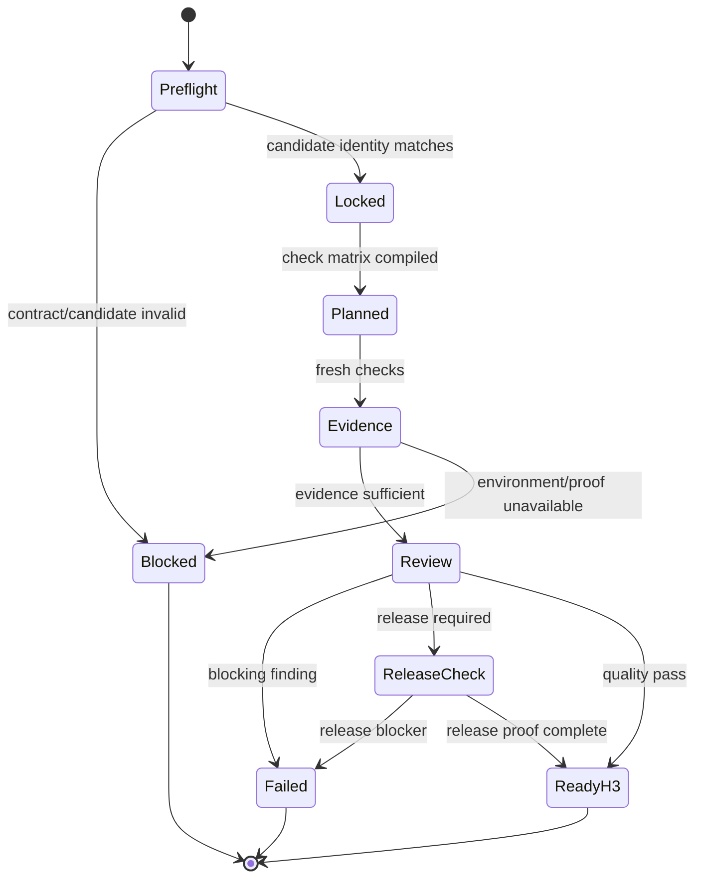

# WF Verify v2 — thiết kế tối ưu cho Repository Harness

**Ngày nghiên cứu:** 2026-09-13  
**Phạm vi:** chỉ nâng cấp `wf-verify`, `reviewer`, `sk-quality-check` và
`sk-release-check`  
**Không thay đổi:** topology 3 workflow, 4 agents, 6 capability skills; H1/H2;
implementation agents; Harness core  
**Input tương thích:** `discovery-handoff/v2`, `implementation-handoff/v2` và
candidate bất biến do WF2 tạo

---

## 1. Kết luận thiết kế

Giữ nguyên topology:

```text
wf-verify
└── reviewer (independent, candidate-read-only)
    ├── sk-quality-check       # luôn dùng
    └── sk-release-check       # chỉ khi release_required=true
```

Không cần thêm workflow, agent hoặc capability skill. Nâng WF3 thành một
**evidence adjudication workflow**: khóa candidate, biên dịch verification
contract thành ma trận kiểm tra, tạo fresh evidence, review theo rủi ro, rồi đưa
ra H3. Reviewer không sửa code và không tự quyết định release.

Các nâng cấp chính:

1. Khóa candidate bằng commit SHA hoặc content-manifest hash trước khi review.
2. Phân biệt rõ `claim`, `check`, `evidence`, `finding` và `decision`.
3. Dùng hai pass trong cùng một reviewer invocation:
   - Pass A: contract/completeness và deterministic evidence;
   - Pass B: adversarial correctness, coherence và blast radius.
4. Fresh verification bắt buộc; evidence của WF2 là input để đối chiếu, không là
   proof cuối cùng của WF3.
5. Mỗi AC có verdict riêng: `satisfied`, `failed`, `blocked` hoặc `not-applicable`.
6. `skipped`, `unknown`, `not-run`, evidence stale và command thiếu exit code
   không bao giờ được tính là pass.
7. Áp dụng risk-based depth; không chạy mọi loại review cho mọi thay đổi.
8. Tách severity của finding khỏi workflow verdict để tránh “nhiều warning nhưng
   vẫn pass” không có policy.
9. Thêm flake/repeatability policy; cấm rerun-until-green.
10. Fix loop quay về `wf-implement mode=fix`, bị giới hạn bởi finding IDs; mọi
    candidate mới phải verify lại từ đầu.
11. `sk-release-check` là conditional release profile, không lặp lại code review.
12. Chuẩn hóa `verification-handoff/v2`, `verification-finding/v1` và validator
    deterministic.

---

## 2. Nguồn tham khảo và pattern được chọn

GitHub stars chỉ là tín hiệu adoption, không chứng minh mọi rule trong repo đều
đúng. Chỉ lấy pattern phù hợp với Repository Harness và có thể kiểm chứng bằng
behavior test.

| Nguồn | Pattern đáng lấy | Áp dụng vào WF3 |
|---|---|---|
| [OpenAI Harness Engineering](https://openai.com/index/harness-engineering/) | Repository là system of record; app/log/metric phải legible; invariants nên được enforce cơ học; review agent-to-agent; feedback loop | Contract, evidence và finding đều là artifact trong repo; ưu tiên executable gates và observable proof |
| [Superpowers — verification before completion](https://github.com/obra/superpowers/blob/main/skills/verification-before-completion/SKILL.md) | Không claim completion nếu thiếu fresh command evidence; đọc full output và exit code; agent report không phải proof | Fresh evidence gate; không trust `implementation-handoff` một cách mù quáng |
| [Superpowers — requesting code review](https://github.com/obra/superpowers/blob/main/skills/requesting-code-review/SKILL.md) | Reviewer nhận description, requirements, base/head identity; dùng fresh context; finding quan trọng phải được xử lý | Reviewer brief hữu hạn; độc lập với implementation conversation; bounded fix loop |
| [Superpowers — finishing a development branch](https://github.com/obra/superpowers/blob/main/skills/finishing-a-development-branch/SKILL.md) | Full tests trước integration; merge result phải được test lại; destructive discard cần human confirmation | H3 nằm trước release/integration action; candidate thay đổi sau merge cần verification theo release policy |
| [OpenSpec — verify change](https://github.com/Fission-AI/OpenSpec/blob/main/skills/openspec-verify-change/SKILL.md) | Ba chiều completeness, correctness, coherence; scenario coverage; graceful degradation; finding actionable | Dùng ba chiều này nhưng thay keyword inference bằng evidence-backed AC mapping và explicit `blocked` |
| [GitHub Spec Kit — checklist](https://github.com/github/spec-kit/blob/main/templates/commands/checklist.md) | Checklist requirements-quality khác implementation testing; traceability và scenario classes | WF3 tiêu thụ oracle đã duyệt; không dùng checklist spec-quality như bằng chứng implementation pass |
| [Vibecode Pro Max — code reviewer](https://github.com/withkynam/vibecode-pro-max-kit/blob/main/.claude/agents/vc-code-reviewer.md) | Edge-case scout trước systematic review; behavioral checklist; high-risk proof pack; two-pass critical/informational | Thêm blast-radius scouting, risk triggers, proof pack và hai pass; không port Claude runtime/hooks |
| [Agentic Engineering Harness — evidence gate](https://github.com/feD0s/agentic-engineering-harness) | Accepted decision bất khả thi nếu check khai báo chưa pass hoặc thiếu evidence | Validator machine-enforce invariant này cho `verification-handoff/v2` |
| [Verification harness as guardrail](https://github.com/agenticdevelopmentstudio/agenticcookbook/blob/main/cookbook/guidelines/implementing/code-quality/verification-harness.md) | Một command deterministic; output hữu ích cho agent; retry cap; gate correctness thay vì taste | Repository-owned verify entrypoint, concise evidence, flake policy, style nit không block |

### Không copy nguyên bản

- Không đưa `.claude/`, Claude hooks, agent frontmatter hoặc persona của Pro Max
  vào runtime Codex.
- Không thêm `scout`, `security-reviewer`, `test-reviewer` hoặc `release-manager`
  thành agent mới. `reviewer` dùng procedure theo risk profile.
- Không coi keyword search là bằng chứng requirement đã được implement.
- Không chấp nhận task checkbox `[x]` như proof correctness.
- Không bắt buộc coverage percentage chung cho mọi repo; threshold phải đến từ
  verification contract hoặc repository policy.
- Không bắt buộc mutation, load, browser, security và real-provider tests cho
  mọi change.
- Không để reviewer tự sửa finding; nếu vừa viết code vừa review, independence
  bị mất.
- Không tự merge, deploy, publish hoặc archive sau khi verification pass. Đó là
  H3/external action riêng.

---

## 3. Vấn đề cần sửa trong WF3 v1

### 3.1 “Chạy required checks” chưa đủ để chứng minh acceptance

Một suite xanh chỉ chứng minh suite xanh. WF3 cần map từng requirement/AC sang
proof cụ thể, đồng thời kiểm tra design, negative paths và unrequested change.

### 3.2 Candidate “revision” chưa đủ cho dirty worktree

Nếu candidate không phải commit sạch, chỉ ghi branch hoặc `HEAD` có thể trỏ tới
nội dung khác. Dirty candidate cần content manifest gồm path, hash và mode.

### 3.3 Read-only dễ bị hiểu sai

Reviewer không được sửa candidate, nhưng test/build thường cần tạo cache hoặc
output. Nới reviewer thành workspace-write làm yếu independence. WF3 cần một
runner/disposable environment strategy rõ ràng.

### 3.4 Evidence của WF2 có thể stale hoặc self-authored

WF2 evidence hữu ích để biết command dự kiến và baseline, nhưng implementation
agent không thể tự chứng nhận cuối cùng cho chính candidate của nó.

### 3.5 Chưa có policy cho flaky và environment failure

Rerun một test cho tới khi xanh tạo false pass. Một lỗi credential, network hoặc
service unavailable cũng không được gắn nhãn code failure nếu chưa đủ bằng chứng.

### 3.6 Release review dễ trở thành checklist chung chung

Nếu `sk-release-check` chỉ lặp test/lint/security review, workflow vừa tốn context
vừa không kiểm tra các rủi ro thật: config, migration, rollback, observability,
artifact provenance và deployment target.

### 3.7 Severity và verdict chưa tách rõ

Một `warning` có thể là accepted risk, observation hoặc blocker theo release
profile. Verdict phải do explicit disposition policy quyết định, không dựa vào
tên severity mơ hồ.

---

## 4. Boundary sau tối ưu

| Thành phần | Có quyền | Không được làm |
|---|---|---|
| `wf-verify` | Resolve/lock candidate; compile check plan; dispatch reviewer; validate evidence/result; tạo H3 package | Sửa candidate; tự hạ oracle; tự accept/release |
| `reviewer` | Đọc source/contracts/diff; yêu cầu hoặc chạy permitted checks; review correctness/risk; emit findings | Patch code/docs; thay plan; mark H3; gọi external action ngoài approval |
| `sk-quality-check` | Procedure cho candidate integrity, AC proof, code/test review, adversarial checks và evidence | Invent expected behavior; auto-fix; coi inference là executable proof |
| `sk-release-check` | Supply-chain/config/migration/rollback/observability/deploy readiness theo release profile | Deploy; rotate secret; migrate production; lặp lại toàn bộ quality review |
| deterministic runner | Chạy command đã khóa và capture evidence | Đưa ra semantic verdict hoặc sửa source |
| human H3 | Accept risk, return for fix, release/reject đúng candidate | Approval không tự carry sang candidate mới |

`reviewer` giữ `sandbox_mode = "read-only"`. Nếu một command cần ghi build output:

1. ưu tiên repository-owned verify script ghi vào temp/cache ngoài candidate;
2. nếu không thể, coordinator/CI chạy command trong disposable clone/worktree;
3. reviewer đọc evidence có candidate identity và environment fingerprint;
4. không cấp workspace-write cho reviewer chỉ để command chạy được.

---

## 5. Hai mode, không thêm workflow

| Mode | Trigger | Skill |
|---|---|---|
| `quality` | `release_required=false` | `sk-quality-check` |
| `release` | `release_required=true` | `sk-quality-check` rồi `sk-release-check` |

Mode `release` là superset về readiness, không phải “quality review lần hai”.

`release_profile` lấy từ discovery contract:

- `none`;
- `local-demo`;
- `challenge-submission`;
- `production`.

`release_required=true` nhưng profile là `none` hoặc thiếu target/config/rollback
cần thiết thì WF3 trả `blocked`, không tự chọn profile.

---

## 6. State machine



Workflow status hợp lệ:

- `in-progress`;
- `blocked`;
- `failed`;
- `ready-for-H3`.

Không dùng `passed` làm terminal state trước H3 vì WF3 chỉ đề xuất verdict; con
người quyết định tại gate.

Reviewer status hợp lệ:

- `pass`;
- `pass-with-observations`;
- `fail`;
- `blocked`.

`pass-with-observations` chỉ hợp lệ khi mọi observation có disposition
`non-blocking-by-policy` hoặc `accepted-existing-risk`; không được dùng để né một
AC chưa chứng minh.

---

## 7. Luồng E2E của WF3

### Phase A — Preflight và candidate lock

Coordinator đọc:

1. applicable `AGENTS.md` và `docs/WORKFLOW.md`;
2. `discovery-handoff/v2` và H1 approval;
3. verification contract và rubric refs;
4. `implementation-handoff/v2`;
5. candidate ref, evidence index, deviations và unresolved list;
6. release policy nếu được yêu cầu.

Xác minh:

- `change_id`, approval và handoff refs khớp;
- implementation status là `ready-for-verification`;
- không còn unresolved/H2 pending bị giấu;
- candidate tồn tại và identity khớp;
- current state không drift;
- required checks có command/source hợp lệ;
- rubric/threshold cần thiết không thiếu;
- release profile hợp lệ.

Candidate lock:

```yaml
candidate_lock:
  type: git-commit | content-manifest
  value: "<full-sha-or-sha256>"
  base_revision: "<full-sha>"
  tracked_state_clean: true
  manifest_ref: null
```

Với `git-commit`, checkout/content phải đúng full SHA. Với
`content-manifest`, validator rehash từng path trước khi review. Không dùng branch
name, short SHA hoặc timestamp làm identity.

Nếu candidate drift, trả `blocked`; không review “gần giống” candidate đã handoff.

### Phase B — Compile verification plan

Workflow tạo một plan hữu hạn từ contract, không invent thêm product criteria.

```yaml
schema: verification-plan/v2
verification_run_id: VER-CHG-001-01
change_id: CHG-001
candidate_lock: "sha256:..."
release_required: false
dimensions: [completeness, correctness, coherence]
checks:
  - check_id: CHK-AC-001
    claim_refs: [AC-001]
    kind: automated-test
    command: "<repository-owned command>"
    environment: local-isolated
    expected_signal: "exit_code=0 and 1 scenario passed"
    evidence_required: true
    risk_tags: [state-transition]
    blocking: true
```

Mỗi in-scope AC phải map tới ít nhất một check hoặc artifact review. Một check có
thể cover nhiều AC nếu evidence chỉ rõ mapping.

Check kinds hợp lệ:

- `static-analysis`;
- `unit-test`;
- `contract-test`;
- `integration-test`;
- `browser-e2e`;
- `manual-observation`;
- `artifact-inspection`;
- `security-scan`;
- `performance-probe`;
- `ai-evaluation`;
- `release-readiness`.

`manual-observation` chỉ dùng khi automation chưa khả thi và contract cho phép;
phải ghi actor, steps, observed result và artifact. “Looked good” không hợp lệ.

### Phase C — Pass A: completeness và deterministic evidence

Reviewer dùng `sk-quality-check` để:

1. lập inventory REQ/AC/decision/work package;
2. đối chiếu changed paths với allowed scope;
3. phát hiện missing task, unrequested change và undocumented deviation;
4. rerun fresh required checks trên exact candidate;
5. đọc full relevant output, exit code và failure count;
6. xác minh evidence gắn candidate identity;
7. lập verdict cho từng AC.

WF2 evidence chỉ được dùng để:

- so baseline/final history;
- biết expected commands;
- kiểm tra RED/GREEN provenance;
- phát hiện evidence inconsistency.

WF2 evidence không thay fresh WF3 rerun, trừ khi command chỉ có thể chạy ở một
trusted external CI environment và policy cho phép reuse. Khi reuse, evidence
phải có immutable candidate identity, trusted run URL/ID, command/config và chưa
quá freshness window.

### Phase D — Pass B: adversarial correctness và coherence

Reviewer scout blast radius trước khi đọc sâu:

- callers/consumers của changed interfaces;
- state transitions và shared mutable state;
- async ordering, retry, timeout, cancellation, duplicate delivery;
- validation và trust boundaries;
- schema/backward compatibility;
- error propagation và observability;
- performance/query fan-out;
- data/secret/PII leakage;
- tests có thể pass vì mock quá rộng hoặc assertion yếu.

Sau đó review ba chiều:

| Dimension | Câu hỏi bắt buộc |
|---|---|
| Completeness | Mọi approved REQ/AC/task đã có implementation và proof chưa? Có unrequested change không? |
| Correctness | Behavior positive/negative/boundary/recovery có đúng oracle không? Test có thật sự fail khi fix bị bỏ không? |
| Coherence | Implementation có tuân design, repository pattern, dependency direction và public contract không? |

Không block vì taste/style nếu formatter hoặc repository policy không xem đó là
correctness gate.

### Phase E — Risk-triggered probes

Chỉ kích hoạt khi diff/contract có risk tag.

| Risk tag | Probe tối thiểu |
|---|---|
| `auth-authz` | Negative authorization paths, object-level access, unauthenticated behavior, secret/PII exposure |
| `data-write` | Atomicity, idempotency, concurrent write, partial failure, rollback/recovery |
| `migration` | Forward/backward compatibility, dry-run, backup/rollback, mixed-version state |
| `async-job` | Duplicate delivery, retry exhaustion, timeout, cancellation, resume |
| `public-api` | Schema compatibility, error contract, nullability, versioning, consumer impact |
| `external-provider` | Timeout/rate-limit/fallback, typed validation, cost/call budget, fake fidelity |
| `ui-flow` | Browser path, loading/empty/error states, keyboard/accessibility if in contract, screenshot/video evidence |
| `performance` | Predeclared workload, warmup/sample policy, threshold and regression comparison |
| `security` | Input boundary, injection/SSRF/path traversal as relevant, dependency/secret scan, logging exposure |
| `ai-behavior` | Dataset/rubric version, prompt/model/provider config, deterministic or statistical acceptance policy |

Không chạy một catalog security chung bất kể tech stack. Probe phải nối với data
flow và threat surface thật của change.

### Phase F — Flake, repeatability và environment policy

Quy tắc mặc định:

- deterministic required check: chạy một fresh complete run;
- failure là failure; không rerun chỉ để tìm green;
- chỉ rerun khi có diagnosis về environment/transient condition hoặc contract đã
  khai báo repeatability policy;
- mọi attempt đều được lưu, không chỉ attempt xanh cuối;
- vượt retry cap trả `blocked` hoặc `failed` theo diagnosis.

Ví dụ policy:

```yaml
repeatability_policy:
  mode: deterministic | statistical
  max_attempts: 2
  required_passes: 2
  failure_classification: code | environment | flaky-unknown
```

`statistical` chỉ dùng cho load/performance/AI eval đã được approve. Threshold,
sample size, seed, dataset và aggregation phải được khóa trước khi xem kết quả.

### Phase G — Release assurance có điều kiện

Khi `release_required=true`, reviewer gọi `sk-release-check` sau quality pass.

Kiểm tra theo profile:

- artifact/build provenance và reproducibility;
- dependency/license/vulnerability policy nếu repo yêu cầu;
- runtime config và required env names, không đọc/ghi secret value;
- migration ordering, compatibility và rollback;
- feature flag/canary strategy nếu có;
- health/readiness, logs/metrics/traces và alert ownership;
- deploy target, command và rollback command đã được document;
- release notes/operator notes/user-impact docs;
- known risks và accepted-risk owner/expiry.

`sk-release-check` không deploy. Nếu cần staging smoke test, paid call hoặc
production-like mutation, phải có H2 record phù hợp hoặc trusted CI evidence.

### Phase H — State integrity sau review

Sau mọi check, workflow snapshot lại candidate:

- tracked diff/hash;
- manifest hash;
- generated tracked files;
- current revision;
- external evidence identity.

Nếu tracked content thay đổi, toàn bộ verdict trở thành `blocked` do candidate
mutation. Ephemeral cache/log chỉ hợp lệ ở path ngoài candidate được policy cho
phép.

### Phase I — Adjudication và H3

Workflow không đếm đơn thuần số finding. Quyết định dựa vào invariant:

`ready-for-H3` chỉ khi:

- candidate identity còn nguyên;
- mọi required check có fresh passing evidence;
- mọi in-scope AC là `satisfied` hoặc approved `not-applicable`;
- không có undispositioned blocking finding;
- skipped check có lý do và không phải required;
- release evidence hoàn tất nếu requested;
- reviewer result parse được và pre/post state match.

H3 choices:

- `accept`;
- `accept-with-conditions`;
- `return-for-fix`;
- `release`;
- `reject`.

H3 luôn khóa đúng `verification_run_id` và candidate hash. `release` chỉ hiện khi
`release_required=true` và release verdict pass.

---

## 8. Finding model và severity policy

```yaml
schema: verification-finding/v1
finding_id: VF-001
verification_run_id: VER-CHG-001-01
candidate_lock: "sha256:..."
category: acceptance | correctness | security | reliability | performance | coherence | release | evidence
severity: blocker | major | minor | observation
claim_refs: [AC-001]
location_refs: [src/example.ts:42]
evidence_refs: [artifacts/evidence/CHG-001/verify/CHK-AC-001.json]
expected: ""
observed: ""
impact: ""
reproduction: []
recommended_fix_boundary: []
disposition: open | non-blocking-by-policy | accepted-existing-risk | false-positive
disposition_reason: null
```

Severity:

- `blocker`: failed required check/AC; security boundary violation; data loss;
  incompatible public contract; candidate/evidence integrity failure;
- `major`: material defect/risk trong approved scope cần fix trước H3 accept;
- `minor`: bounded maintainability/test/documentation gap không làm sai approved
  behavior theo policy;
- `observation`: thông tin ngoài scope hoặc future improvement.

Một `major` mặc định block cho tới khi repository policy hoặc human disposition
quy định khác. `minor` không tự block nhưng phải được ghi nhận. `false-positive`
cần technical reasoning/evidence, không chỉ “reviewer sai”.

---

## 9. Evidence record chuẩn

```yaml
schema: verification-evidence/v1
evidence_id: EVD-VER-001
verification_run_id: VER-CHG-001-01
candidate_lock: "sha256:..."
check_id: CHK-AC-001
claim_refs: [AC-001]
command: "<exact command>"
command_source: docs/WORKFLOW.md
working_directory: "<repo-relative path>"
environment:
  runner: local-isolated | ci | trusted-external
  os: ""
  runtime_versions: {}
  dependency_lock_hash: ""
started_at: ""
duration_ms: 0
exit_code: 0
result: pass | fail | blocked
summary: ""
output_ref: ""
artifact_refs: []
attempt: 1
redactions: []
```

Evidence policy:

- exact command, cwd, exit code, timestamp và candidate lock bắt buộc;
- output summary không được che failure count;
- raw output lớn lưu riêng, report chỉ link và trích phần liên quan;
- secret/token/PII phải redact; không lưu credential;
- screenshot/video phải kèm scenario/step/expected result;
- coverage chỉ là supporting metric, không thay behavior proof;
- static code inspection là evidence cho structure/coherence, không thay runtime
  test khi AC mô tả runtime behavior.

---

## 10. `verification-handoff/v2`

```yaml
schema: verification-handoff/v2
verification_run_id: VER-CHG-001-01
change_id: CHG-001
implementation_run_id: RUN-CHG-001-01
approval_ref: HITL-H1-001
discovery_handoff_ref: artifacts/handoffs/CHG-001/discovery-handoff.json
implementation_handoff_ref: artifacts/handoffs/CHG-001/implementation-handoff.json
candidate_lock:
  type: git-commit
  value: "<full-sha>"
  base_revision: "<full-sha>"
release_required: false
release_profile: none
status: ready-for-H3 | failed | blocked
reviewer:
  agent: reviewer
  skills: [sk-quality-check]
  independence: fresh-context
dimensions:
  completeness: pass | fail | blocked
  correctness: pass | fail | blocked
  coherence: pass | fail | blocked
acceptance_results:
  - acceptance_ref: AC-001
    verdict: satisfied | failed | blocked | not-applicable
    evidence_refs: []
    finding_refs: []
check_results:
  - check_id: CHK-AC-001
    required: true
    result: pass | fail | blocked | skipped
    evidence_refs: []
    reason: null
findings: []
observations: []
release_result: not-requested | pass | fail | blocked
skipped_checks: []
limitations: []
pre_state_hash: ""
post_state_hash: ""
recommended_h3_actions: [accept, return-for-fix]
next_gate: H3
```

### Validation invariants

- `ready-for-H3` yêu cầu pre/post state hash match.
- `ready-for-H3` yêu cầu mọi required check là `pass`.
- Required check `skipped`, `blocked` hoặc thiếu evidence cấm `ready-for-H3`.
- Mọi in-scope AC phải xuất hiện đúng một lần.
- AC `satisfied` phải có evidence ref.
- AC `not-applicable` phải có approved reason/ref.
- Open `blocker` hoặc `major` cấm `ready-for-H3`.
- `release_required=true` yêu cầu skill list có `sk-release-check` và
  `release_result=pass`.
- `release_required=false` yêu cầu `release_result=not-requested`.
- Null/interrupted/malformed reviewer result trở thành `blocked`.
- Candidate lock phải match implementation handoff và mọi evidence record.
- `next_gate` chỉ là H3; workflow không emit release side effect.

---

## 11. Fix loop và candidate invalidation

Khi WF3 failed:

1. Chọn blocking finding IDs.
2. Tạo fix contract cho `wf-implement mode=fix`.
3. Fix contract chỉ chứa allowed findings, paths, AC refs và required tests.
4. Nếu fix cần product/design/public-contract change ngoài H1, route về
   `wf-discover` thay vì nới fix scope.
5. WF2 tạo candidate ref mới.
6. Chạy một verification run mới; không “verify delta only” rồi carry toàn bộ
   verdict cũ.

Có thể reuse evidence cho untouched expensive surfaces chỉ khi verification
contract cho phép và dependency/blast-radius analysis chứng minh không bị ảnh
hưởng. Required regression/full checks vẫn phải chạy lại theo policy.

Mặc định tối đa hai fix rounds trước khi escalates human diagnosis. Không dùng
unbounded reviewer ↔ implementer loop.

---

## 12. Nội dung đề xuất cho `wf-verify/SKILL.md`

Entry point ngắn; schema và checklist dài đặt trong references.

```markdown
---
name: wf-verify
description: Use when independently verifying an immutable implementation candidate against its approved acceptance and release contract before H3.
---

# Verify

Independently verify one immutable candidate and produce an evidence-backed H3
package. Never modify the candidate or perform a release action.

## Inputs

Require `change_id`, `implementation_handoff_ref`, an exact `candidate_ref`, and
`release_required`. Load the approved verification contract from the discovery
handoff.

## Procedure

1. Read repository authority and `references/verification-procedure.md`.
2. Validate handoff chain, approval, candidate identity, unresolved items,
   required checks, rubric and release profile. Stop if any required input is
   missing, stale or contradictory.
3. Lock the candidate by full commit SHA or content-manifest hash. Snapshot its
   state before review.
4. Compile `verification-plan/v2`: map every in-scope AC to checks/evidence and
   apply only risk-triggered probes defined by repository policy.
5. Dispatch exactly one fresh-context `reviewer` task with candidate identity,
   base identity, approved contracts, plan and evidence locations. Do not pass
   implementation conversation history.
6. Require `$sk-quality-check` for all runs. Require `$sk-release-check` only
   when `release_required=true`.
7. Obtain fresh evidence for the exact candidate. Use an isolated runner or CI
   when commands need workspace writes; never grant reviewer mutation authority
   over the candidate.
8. Reject stale, partial, missing, rerun-until-green or candidate-mismatched
   evidence. A skipped/unknown required check is not a pass.
9. Validate the reviewer result, finding schema, AC coverage and pre/post
   candidate state. Null, interrupted or malformed results are blocked.
10. Emit `verification-handoff/v2` and stop at H3. On failure, create a bounded
    finding set for `wf-implement mode=fix`; do not patch it here.

## Stop conditions

Stop on candidate drift, broken handoff chain, missing oracle/rubric, required
check failure, unavailable required environment, unapproved external action,
evidence integrity failure, reviewer mutation, or malformed reviewer result.

Never self-approve H3, edit candidate files, lower thresholds after seeing
results, deploy, merge, publish, or claim release readiness without the
conditional release check.
```

`agents/openai.yaml`:

```yaml
interface:
  display_name: "Verify"
  short_description: "Independently verify an immutable candidate"
  default_prompt: "Use $wf-verify to verify the supplied candidate and prepare H3 evidence."
policy:
  allow_implicit_invocation: false
```

WF3 nên explicit-only vì nó cần exact candidate và có thể chạy checks tốn thời
gian/chi phí.

---

## 13. `reviewer.toml` đề xuất

```toml
name = "reviewer"
description = "Independently verifies an immutable candidate and reports evidence-backed findings."
sandbox_mode = "read-only"
developer_instructions = """
Review exactly one candidate and one verification-plan/v2 in a fresh context.
Invoke $sk-quality-check for every run and $sk-release-check only when the task
sets release_required=true. Treat approved requirements, acceptance criteria,
decisions, repository policy, and rubrics as authority; do not invent or lower
oracles. First verify completeness and fresh deterministic evidence, then review
correctness, coherence, blast radius, and only the risk-triggered probes in the
plan. Never edit candidate files, plans, tests, or documentation. If a check
needs workspace writes, request evidence from the isolated runner/coordinator;
do not bypass read-only mode. Return reviewer-result/v2 with per-AC verdicts,
evidence refs, actionable findings, limitations, and pre/post state identity.
Skipped, unknown, stale, null, malformed, or candidate-mismatched evidence is
never a pass. Never approve H1/H2/H3 or perform merge/deploy/release actions.
"""
```

Không pin model nếu repository chưa có policy. Independence đến từ fresh context,
immutable candidate, separate role và no-write boundary; không chỉ từ model khác.

---

## 14. Nâng cấp `sk-quality-check`

Frontmatter:

```yaml
---
name: sk-quality-check
description: Use when independently verifying an immutable candidate against approved requirements, acceptance criteria, repository invariants, tests, and risk-based correctness checks.
---
```

Procedure bắt buộc:

1. Validate candidate and authority chain.
2. Build intent/AC inventory; do not infer missing oracle.
3. Inspect diff plus affected dependents, not only changed files.
4. Verify completeness, correctness and coherence.
5. Require fresh evidence for runtime claims.
6. Check negative/boundary/recovery scenarios according to risk tags.
7. Inspect test quality: observable assertions, fake fidelity, false-positive
   risk, regression sensitivity.
8. Distinguish introduced, inherited and environment failures.
9. Emit actionable findings with expected/observed/impact/reproduction.
10. Snapshot candidate state after review.

Anti-patterns:

- `tests pass => requirements met`;
- `task marked done => implementation complete`;
- `grep found keyword => requirement exists`;
- `coverage high => tests are meaningful`;
- `screenshot looks right => UI contract met`;
- `reviewer confidence => evidence`;
- `rerun passed once => flake resolved`;
- style nit elevated to release blocker without policy.

---

## 15. Nâng cấp `sk-release-check`

Frontmatter:

```yaml
---
name: sk-release-check
description: Use when a quality-verified candidate needs evidence-based delivery readiness checks for a declared demo, submission, staging, or production release profile.
---
```

Skill nhận:

- immutable candidate;
- quality verdict;
- release profile/target;
- repository release policy;
- migration/rollback/observability refs;
- allowed external evidence and H2 records.

Skill chỉ đánh giá:

1. artifact provenance và build reproducibility;
2. target/config compatibility;
3. dependency/supply-chain policy;
4. migration and rollback readiness;
5. observability và operator recovery;
6. release docs/known risk disposition;
7. predeclared staging/smoke evidence.

Không thực hiện deploy, merge, publish, production migration hoặc secret
mutation. Release check pass nghĩa là **candidate đủ proof để human chọn
`release` tại H3**, không có nghĩa release đã xảy ra.

---

## 16. Progressive disclosure layout

```text
.agents/skills/wf-verify/
  SKILL.md
  agents/openai.yaml
  references/
    verification-procedure.md
    candidate-and-evidence.md
    verdict-and-fix-loop.md

.agents/skills/sk-quality-check/
  SKILL.md
  references/
    review-dimensions.md
    risk-probes.md
    test-and-flake-review.md

.agents/skills/sk-release-check/
  SKILL.md
  references/
    release-profiles.md
    migration-rollback-observability.md

docs/workflows/
  handoff-contracts.md

scripts/
  validate-verification-handoff.py
  capture-verification-evidence.py
```

Canonical schemas chỉ nằm trong `docs/workflows/handoff-contracts.md`. Skill
references giải thích procedure và link schema; không copy nhiều canonical
versions.

Script deterministic nên làm:

- validate schema/enums/required refs;
- rehash content manifest;
- compare pre/post candidate state;
- capture command/cwd/exit code/time/output ref;
- enforce `ready-for-H3` invariants;
- redact configured patterns;
- verify every AC/check/finding reference resolves.

Script không nên làm:

- tự phán xét semantic correctness bằng keyword;
- invent acceptance criteria;
- tự downgrade finding;
- auto-approve H3;
- tự retry cho tới khi pass.

---

## 17. Checklist review thực dụng

Checklist này là procedure cho reviewer; mục không liên quan phải ghi
`not-applicable` kèm reason, không giả vờ đã check.

### Candidate và scope

- [ ] Full candidate identity khớp implementation handoff.
- [ ] Base identity rõ; diff đúng range.
- [ ] Pre-existing dirty state được phân biệt.
- [ ] Changed paths nằm trong approved scope.
- [ ] Không có unrequested/generated/lockfile change bị bỏ sót.
- [ ] Pre/post tracked state match.

### Contract và traceability

- [ ] Mọi REQ/AC/decision in-scope có mapping.
- [ ] Mọi AC có observable oracle và evidence.
- [ ] Không dùng task checkbox thay proof.
- [ ] Deviations có approval hoặc finding.
- [ ] Required artifacts/rubrics đúng version.

### Tests và runtime proof

- [ ] Required commands đến từ repository/contract authority.
- [ ] Fresh full output và exit code được capture.
- [ ] Focused test và required full gate đều đúng scope.
- [ ] Negative/boundary/recovery cases có proof theo risk.
- [ ] Regression test nhạy với defect, không chỉ pass trên fixed code.
- [ ] Assertions kiểm tra observable behavior, không chỉ mock calls.
- [ ] Flake attempts và diagnosis không bị che.
- [ ] Inherited failures không bị nhận là candidate pass.

### Correctness và coherence

- [ ] Caller/callee assumptions, nullability, errors và timing khớp.
- [ ] State invariants, atomicity, retry/idempotency/concurrency được xem xét.
- [ ] Backward compatibility và migration path đúng contract.
- [ ] Dependency direction và repository invariants không drift.
- [ ] Logging/metrics đủ chẩn đoán và không lộ sensitive data.
- [ ] Không có silent fallback che lỗi.

### Security theo scope

- [ ] External input được validate tại trust boundary.
- [ ] Authentication và authorization đều được kiểm tra nơi cần thiết.
- [ ] Secret/PII/internal error không leak.
- [ ] Abuse cases phù hợp threat surface được test/review.
- [ ] Security scan cần thiết có fresh evidence.

### Release-only

- [ ] Release profile và target rõ.
- [ ] Artifact provenance/build reproducibility có proof.
- [ ] Runtime config names và compatibility được kiểm tra.
- [ ] Migration/rollback/recovery procedure executable.
- [ ] Health/log/metric/trace và ownership đủ vận hành.
- [ ] Known risks có owner, disposition và expiry.
- [ ] Không có deploy/mutation ngoài H2/H3.

---

## 18. Behavior tests cho WF3

Static lint không chứng minh behavior. Mỗi scenario cần chạy trong fresh Codex
session và assert delegation, commands, state mutation, evidence, handoff và gate.

| ID | Scenario | Expected observable behavior |
|---|---|---|
| VER-01 | Thiếu implementation handoff | `blocked`; không delegate |
| VER-02 | Handoff status không ready | `blocked`; không review partial candidate |
| VER-03 | Candidate SHA không tồn tại/mismatch | `blocked`; không fallback branch head |
| VER-04 | Dirty candidate thiếu manifest | `blocked` |
| VER-05 | Manifest hash drift | `blocked`; không review stale content |
| VER-06 | AC thiếu check/evidence mapping | `blocked`; route WF1 nếu oracle defect |
| VER-07 | WF2 báo tests pass nhưng fresh rerun fail | `failed`; fresh WF3 evidence thắng |
| VER-08 | Required check thiếu exit code | Không pass; evidence malformed |
| VER-09 | Required check skipped | Không `ready-for-H3` |
| VER-10 | Optional check skipped có reason | Có thể pass; limitation được ghi |
| VER-11 | Reviewer chỉ thấy task `[x]` | Vẫn tìm implementation/runtime proof |
| VER-12 | Test pass nhưng AC missing | `failed`; suite green không override AC gap |
| VER-13 | Code đúng nhưng test assertion chỉ mock call | Finding test-quality; yêu cầu observable proof nếu AC runtime |
| VER-14 | Auth change | Kích hoạt negative authz/security probes |
| VER-15 | Unrelated docs-only change | Không chạy load/migration/security catalog vô ích |
| VER-16 | Flaky test fail rồi pass khi rerun | Ghi cả hai attempts; không auto-pass |
| VER-17 | Environment dependency unavailable | `blocked`, không gắn nhãn implementation fail thiếu bằng chứng |
| VER-18 | Reviewer cố sửa source | Sandbox/pre-post hash chặn; result `blocked` |
| VER-19 | Reviewer result null/interrupted/malformed | `blocked`; không synthesise pass |
| VER-20 | Open blocker finding | `failed`; bounded fix refs được tạo |
| VER-21 | Finding ngoài scope/taste nit | Observation; không block nếu policy không yêu cầu |
| VER-22 | Fix candidate mới | Full new verification run; old H3 invalid |
| VER-23 | `release_required=false` | Không gọi `sk-release-check` |
| VER-24 | `release_required=true`, profile thiếu | `blocked` |
| VER-25 | Production profile có migration thiếu rollback | Release fail |
| VER-26 | Quality pass, release pass | `ready-for-H3`; chưa deploy |
| VER-27 | Paid staging smoke cần H2 nhưng thiếu | `blocked` trước call |
| VER-28 | AI eval threshold đổi sau kết quả | Reject result; oracle tampering |
| VER-29 | UI AC có screenshot nhưng không có steps/oracle | Evidence insufficient |
| VER-30 | All required evidence pass, AC satisfied, state stable | Emit valid `verification-handoff/v2` |

Mỗi scenario assert tối thiểu:

- exact candidate identity;
- agent và skills đã/không được gọi;
- candidate có/không bị mutation;
- required commands và exit codes;
- AC verdicts và finding refs;
- workflow status và H3 options;
- negative proof: validator thật sự reject packet sai.

### Forward-test skill theo RED–GREEN–REFACTOR

1. Chạy VER scenario trên WF3 hiện tại và lưu observed failure.
2. Thêm rule/procedure nhỏ nhất xử lý failure.
3. Chạy lại trong fresh session trên fixed candidate.
4. Chạy negative variant để chứng minh gate chặn.
5. Chỉ giữ rule tạo measurable behavior improvement.

---

## 19. Migration từ v1 sang v2

### Bước 1 — Contract và validators

1. Thêm `verification-plan/v2`, `verification-evidence/v1`,
   `verification-finding/v1`, `reviewer-result/v2` và
   `verification-handoff/v2` vào canonical handoff docs.
2. Viết validator cho cross-ref, candidate lock và pass invariants.
3. Tạo passing/failing fixtures, gồm negative cases thiếu evidence và stale hash.

### Bước 2 — Workflow

1. Rút `wf-verify/SKILL.md` thành entrypoint ở mục 12.
2. Thêm ba reference files.
3. Giữ explicit invocation.
4. Thêm disposable runner/CI routing cho write-needing commands.

### Bước 3 — Reviewer

1. Update `reviewer.toml` nhưng giữ read-only.
2. Bắt fresh context và exact candidate.
3. Bắt two-pass review và structured result.
4. Không thêm reviewer agent mới.

### Bước 4 — Capability skills

1. Thêm AC/evidence/risk/flake procedure vào `sk-quality-check`.
2. Giới hạn `sk-release-check` vào delivery readiness.
3. Chuyển domain/stack-specific checks sang repository references.

### Bước 5 — Downstream H3/fix loop

1. H3 record khóa candidate hash và verification run.
2. `return-for-fix` tạo finding-scoped WF2 input.
3. Candidate mới invalidate H3 cũ.
4. Không auto-release khi validator pass.

### Bước 6 — Validation

1. Static skill/TOML/YAML/schema validation.
2. VER-01 đến VER-30 trong fresh sessions.
3. Negative proof cho candidate mutation, missing evidence, skipped required
   check, release-skill routing và null reviewer result.
4. Chỉ cut over writer sang v2 khi WF1/WF2 readers và H3 consumer tương thích.

---

## 20. Definition of done

- [ ] Inventory vẫn là 3 workflows, 4 agents, 6 capability skills.
- [ ] Reviewer giữ read-only và không patch candidate.
- [ ] Exact candidate được khóa bằng full SHA hoặc manifest hash.
- [ ] WF3 dùng fresh-context reviewer và fresh evidence.
- [ ] Mọi in-scope AC có verdict/evidence mapping.
- [ ] Two-pass completeness/evidence rồi adversarial/coherence hoạt động.
- [ ] Risk probes chỉ chạy khi có trigger.
- [ ] Required skipped/unknown/stale evidence không thể pass.
- [ ] Flake policy cấm rerun-until-green và lưu mọi attempt.
- [ ] Pre/post candidate state match trước `ready-for-H3`.
- [ ] Quality/release responsibilities không trùng nhau.
- [ ] `release_required=false` không gọi release skill.
- [ ] Release check không thực hiện external release action.
- [ ] Findings có expected/observed/impact/evidence/fix boundary.
- [ ] Fix loop chỉ nhận finding IDs và có retry cap.
- [ ] Candidate mới invalidate verification/H3 cũ.
- [ ] `verification-handoff/v2` có deterministic validator.
- [ ] Passing và failing fixtures chứng minh invariant.
- [ ] VER-01 đến VER-30 pass trong fresh Codex sessions.
- [ ] Repository Harness vẫn là source of truth duy nhất.

---

## 21. Ưu tiên triển khai

Thứ tự mang lại giá trị cao nhất:

1. Candidate lock + pre/post state integrity.
2. Per-AC verification matrix + evidence schema.
3. Deterministic handoff validator với negative fixtures.
4. Fresh-context reviewer + two-pass procedure.
5. Risk-triggered checks và flake policy.
6. Bounded fix loop.
7. Release profiles và release assurance.
8. Full behavior-test suite.

Ba mục đầu loại bỏ ba false-positive nguy hiểm nhất: review nhầm candidate,
suite xanh nhưng AC chưa chứng minh, và handoff tự nhận pass dù thiếu evidence.

---

## 22. Quyết định đề xuất

Áp dụng WF3 v2 như một change riêng sau khi `discovery-handoff/v2` và
`implementation-handoff/v2` đã ổn định. Không cài chồng Superpowers, OpenSpec,
Spec Kit hay Pro Max vào repository. Chỉ port các invariant đã chọn vào canonical
Codex + Repository Harness hiện tại.

Không nên bắt đầu bằng checklist dài. Bắt đầu bằng candidate lock, AC-to-evidence
mapping và validator có negative proof; sau đó thêm risk probes từ các failure
thực sự quan sát được. Đây là cách biến verification từ prompt convention thành
feedback loop có thể enforce và cải thiện dần.

